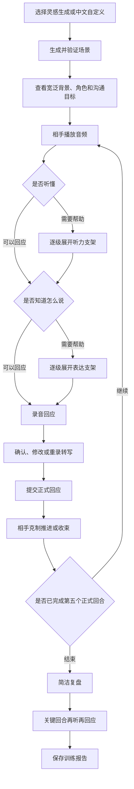

# 交互式日语听说训练产品首个完整里程碑

> 文档性质：产品需求原点
> 版本：Foundation v1
> 适用对象：产品经理、设计师、内容设计者、工程师、测试人员与研究人员
> 配套文档：[延后功能灵感库](./deferred-features.md)

## 1. 文档目的

本文定义一个可以直接进入设计、实现和验收的首个完整里程碑。它回答以下问题：

- 产品为谁解决什么问题。
- 为什么听力理解和口语回应必须放在同一训练闭环中。
- 用户如何获得场景、完成会话、使用支架、确认转写、复盘并重做关键回合。
- 哪些产品对象和行为必须稳定，哪些实现方式可以替换。
- 可靠、可用、可扩展分别意味着什么。
- 哪些测试与用户证据足以证明这一里程碑成立。

本文以稳定产品语义为主，同时记录当前跨端必须一致的字段、wire contract 与恢复边界。实现和模型服务可以替换，但不得改变这些产品事实；团队把本文复制到空项目后，应能据此拆分需求、设计交互、定义数据、编写验收用例并开展用户测试。

## 1.1 当前基线修订：统一入口与本机原题复练

本节修订首里程碑的入口和数据边界，其余听说闭环保持原约定。首页使用一句话中文输入与三个可编辑例子，原位展示完整准备卡，最多追问一次。用户可在同一浏览器保存历史并重新练习原场景。首页中文语音输入只把识别结果填入可编辑输入框，不自动准备、生成或提交场景；取消录音、权限或识别失败、连接中断及迟到结果不得覆盖已有文字，结束识别时释放麦克风。首页中文 STT 与会话中的日语回答 STT 隔离，不得把中文场景识别结果写入日语回答。

- IndexedDB 保存完整场景、独立签名复练凭据、单次报告和反馈；`sessionStorage` 继续负责当前标签页的单场恢复。历史不保存原始音频、临时会话令牌或语音访问令牌，不提供账号、云数据库和跨设备同步。
- 原场景复练通过服务端验证凭据再签发新会话，沿用场景及评价标准。所选记录的表达建议仅在本机带入准备卡与新会话，不发送给模型；展开查看计为 L4 表达支持，准备阶段查看计入首轮。建议保留来源日期，活动快照可恢复，新场景清除。用户可按场景删除全部本机记录；存储失败可重试、继续会话或导出，浏览器数据清理会删除历史。
- 生成场景固定 `evaluationVersion` 与带标识的 `evidencePoints`；反馈逐项返回 `evidenceResults` 和真实回合引用。完成、未完成、未观察、证据不足分别记录，不把没有观察机会的项目算作失败。
- 仅同完整场景定义、同评价版本、同运行模式的完整有效练习可与首次基线比较；mock 不参与跨次比较。模型提供语义判断，程序从帮助与输入事实计算独立性。未查看帮助只能证明用户未查看帮助，不能据此推断“自己听懂”或“独立理解”。
- 修改、重录、文字输入、失败重试和音频完成证据缺失限制独立性判断；前文表达帮助可能污染后续回应，不能仅凭当前回合未点提示就认定独立表达。详细统计默认收起，用户主动展开后再查看，不改变事实导出和比较数据。
- 当前只展示本场景事实比较。等价变体、长期能力趋势、迁移结论与综合分继续延期；原题复练不承诺保持或迁移，原题熟练不等同于能力迁移。

人工评价样本复核与学习效果验证仍待执行。自动测试通过不代表模型语义判断准确，也不代表学习效果成立；操作步骤见 [用户测试模板](./user-test-template.md)。

## 2. 产品定位

本产品是面向中文母语中高级日语学习者的交互式听说训练场。

目标用户通常已经掌握相当于 JLPT N2 的词汇和语法，却仍会在真实交流中遇到以下困难：

- 听见了大部分词，却来不及整合对方的意图和条件。
- 能写出答案，却无法在有限时间内组织成口头回应。
- 不确定关系、直接度、礼貌体或敬语是否合适。
- 一旦漏听时间、数量、否定、转折或选择条件，后续对话就持续跑偏。
- 害怕被即时纠正，因而不敢开口或过度准备。
- 练习材料要么过于固定，要么完全开放，难以兼顾真实需求与稳定训练。

产品让用户在低心理压力、可自主控制节奏的环境中，完成一次有明确沟通目标的日语交流。训练结束后，系统只指出最值得处理的听力点和表达点，并让用户把一个关键回合重新听、重新回应一次。

一句话定义：

> 用户听懂相手在当前情境中的关键意图，用日语作出能推动沟通的回应，再把最值得练的一轮重新听、重新说得更好。

## 3. 首个里程碑的核心判断

首个里程碑要验证的核心判断是：

> 对已有语言知识但实时处理不足的学习者，把相手输入、用户回应、按需支架、简洁复盘和关键回合重做连成一个闭环，能够比孤立听题或孤立口语题更有效地帮助其完成真实沟通。

训练的最小单位是一个回合对：

```text
相手输入
  -> 用户理解意图与关键信息
  -> 用户选择回应策略
  -> 用户用日语回应
  -> 相手依据该回应继续、澄清或收束
```

相手输入和用户回应不可拆成两项互不相关的练习。听力成功的主要证据来自用户是否作出了对得上意图的回应，口语成功也必须结合用户实际听到的内容判断。

首个里程碑至少产生三个可观察结果：

1. 用户抓住相手发话中的主要意图和关键条件，或在不确定时主动澄清。
2. 用户用日语给出能够推进、修复或完成沟通的回应。
3. 用户重做关键回合时，减少了不必要的支架依赖，或在准确度、自然度、得体度上出现明确改善。

首个里程碑不承诺长期能力增长、跨场景迁移、口语等级变化或发音矫正效果。这些方向只有在当场闭环成立后才值得独立验证。

## 4. 目标用户与使用边界

### 4.1 核心用户

- 中文母语者。
- 具备相当于 JLPT N2 的常用词汇和语法储备。
- 能阅读和理解常见日语句子，实时听辨和表达检索仍不稳定。
- 希望练习生活、职场、服务、手续和轻社交中的短时沟通。
- 愿意使用语音完成主要训练，并接受必要时的文字降级。
- 需要可控节奏、低评判感和明确结束点。

### 4.2 典型使用时刻

- 即将面对一场具体沟通，想先模拟一次。
- 暂时没有明确题目，想快速得到一个值得练的情境。
- 想练习听懂限制条件、提出请求、说明状态、澄清误解或确认安排。
- 想知道自己卡在听懂、组织回应还是语体选择。
- 想针对刚才最关键的一轮马上再练一次。

### 4.3 不属于首个里程碑的主要问题

- 从假名、基础词汇和基础语法开始的入门课程。
- 系统性的 JLPT 应试训练。
- 长篇新闻、讲座或影视材料的单向听力课程。
- 音素、音调、重音、口音或发声动作矫正。
- 官方或准官方的口语能力认证。
- 无目标、无轮次上限的陪聊。
- 抢话、打断和双方同时说话的全双工实战。

## 5. 三项质量定义

### 5.1 可靠

可靠意味着用户不会因为一次依赖失败、重复操作或页面中断而丢失整场训练，也不会得到与真实对话不一致的结果。

具体包括：

- 场景生成结果总能被验证并归一为稳定场景契约，不合格结果不会进入训练。
- 同一用户回应只生成一个正式回合，重复点击和迟到响应不能增加轮次。
- 转写未经用户确认不得作为正式回应提交。
- 语音识别、语音合成或语义生成单点失败时，有明确重试、文字降级或回到稳定状态的路径。
- 恢复后不重复播放已确认内容，不重复提交回应，不覆盖更新的状态。
- 相手遵守角色、长度、单问题、事实一致性和收束规则。
- 复盘只引用真实发生的内容，证据不足时可以明确返回证据不足。
- 训练报告能够完整重建用户经历的场景、回合、支架、确认、失败与重做过程。

### 5.2 可用

可用意味着符合画像的用户无需研究人员或操作说明陪同，就能理解入口、开始训练、完成会话、获得适量帮助并完成重做。

具体包括：

- 用户能直接描述想练的事，或点击例子直接准备，准备卡保留修改描述入口。
- 场景准备阶段只展示开始训练所需的信息，不提前泄露相手的具体首句或完整答案。
- 音频播放、暂停、继续、从头重播、查看帮助、录音、停止、确认、修改、重录、重试和退出都有明确状态与结果。暂停与继续属于同一次播放，不计为重听；只有从头重播才记录重听事实。
- 用户能够区分听不懂和不知道怎么说，并进入对应帮助。界面隐藏 L0 至 L4 技术编号，使用面向动作的帮助文案；内部等级和报告字段仍保持稳定。
- 会话时长和轮次可预期，相手不会无限扩展话题。
- 完成页优先展示具体收获、支持结论的真实对话证据、四维本场表现和一个关键回合重做任务；详细证据、听力发现和表达建议在“查看完整复盘”中默认收起。
- 文字降级能让训练继续，同时清楚标记该回合缺少完整语音证据。

### 5.3 可扩展

可扩展意味着后续可以增加场景内容、生成策略、支架、评测、历史和学习功能，而不需要改变首个里程碑的基本训练语义。

具体包括：

- 场景生成与训练执行分离。任何入口最终都提交同一种场景契约。
- 会话由明确阶段和事件推进，不依赖某个页面、某个模型或某个服务的隐式记忆。
- 回合对、支架事件、转写版本、沟通证据、重做记录都有稳定定义。
- 语音识别、语音合成和语义判断可以替换，只要继续满足产品契约。
- 场景、生成规则和评价规则具有语义版本，版本变化不会悄悄改变历史含义。
- 延后能力通过明确接缝接入，不在核心流程中堆叠临时分支。
- 原始训练事实与后续推断分开保存，新的评价方式可以重新分析事实，不必篡改历史记录。

## 6. 产品原则

### 6.1 自由生成场景，受控执行训练

用户可以提出较自由的真实需求，系统也可以主动生成灵感。自由度存在于场景供给阶段。进入训练后，所有场景都必须归一为同一种稳定契约，并受单一沟通目标、单相手、有限轮次、克制相手、安全边界和固定支架规则约束。

这一原则允许内容贴近用户需要，同时让训练、测试、恢复和评价保持可控。

### 6.2 听懂和说出共同构成一次训练

相手音频不是口语练习的背景。用户必须从声音中识别交际意图、关键条件、关系和语气，再据此回应。系统既记录用户说了什么，也记录其如何完成理解。

### 6.3 先完成沟通，再分析语言

会话期间，相手保持角色，不跳出情境讲解语法，不即时给分，不连续抛出多个问题。教学反馈集中在会后。用户先用已有能力完成沟通，再处理准确度、自然度和得体度。

### 6.4 半双工与用户掌控节奏

交互采用半双工回合制。相手发话、用户思考和用户回答在时间上明确分开。用户可以停顿、原速重听、查看支架、录音、修改、重录或退出，不需要一边听一边抢话。

### 6.5 音频优先，文字负责确认和降级

相手每轮先以音频出现，台词默认折叠。用户正常路径以语音回应。文字用于确认转写，也用于设备、权限或网络不支持语音时完成当前会话。首页中文语音输入仅填入可编辑场景输入框，不自动提交；它与会话中的日语回答转写相互隔离。

### 6.6 支架按需出现，并逐步撤除
听力困难和表达困难分成两条帮助路径。系统默认不摊开字幕、翻译和完整参考句。用户逐级获得帮助，重做时帮助重新收起，让用户尝试减少依赖。界面使用动作型帮助文案，不向用户展示 L0 至 L4 技术编号；未查看帮助只能记录为操作事实，不能表述为用户已经听懂或独立理解。

### 6.7 得体和沟通效果优先于复杂度
更长、更复杂或敬语更多不等于更好。首个里程碑关注用户是否听对、是否回应真正的问题、是否推动目标、语体是否适合关系、表达是否清楚自然。

### 6.8 事实由产品状态维护，语义由可替换能力判断
会话阶段、轮次、支架、转写版本、提交状态、恢复、收束和数据记录由确定性的产品规则维护。角色回应、意图对应、语言建议和证据化反馈可由可替换的语义能力提供。任何语义能力都不能自行改写轮次事实、确认事实或用户输入。

## 7. 首个里程碑范围

首个里程碑必须形成以下完整链路：

1. 用户从统一的一句话输入或三个可编辑例子进入。
2. 系统生成或补全场景，并归一为稳定场景契约。
3. 用户确认宽泛背景、角色和沟通目标后开始。
4. 相手以音频发话。
5. 用户按需使用听力支架。
6. 用户按需使用表达支架。
7. 用户以语音回应，并确认转写。
8. 相手依据真实回应克制推进。
9. 第五个正式回合按收束规则结束；放弃或不可恢复失败单独记录，不作为正常完成。
10. 系统给出简洁复盘。
11. 用户重新听取一个关键回合并再次回应。
12. 系统保存可恢复、可导出的训练报告。

### 7.1 明确包含

- 一句话中文描述入口与三个可编辑场景例子。
- 需求明确时直接生成，关键信息缺失时最多追问一次。
- 生成结果的验证、修正或安全回退。
- 单一核心沟通目标和固定五个正式回合。
- 单相手、半双工、音频优先会话。
- 渐进听力支架和渐进表达支架。
- 语音输入、流式或阶段性转写、用户确认和文字降级。
- 克制相手和自然收束。
- 简洁复盘和一个关键回合重做。
- 本地会话恢复、用户主动导出、IndexedDB 原场景历史与事实比较。
- 核心产品事件、行为证据、故障与恢复记录。

### 7.2 明确不包含

- 多目标、多人、多角色或无限轮次会话。
- 深度个性化生成、长期记忆或按历史自动调节难度。
- 训练中即时纠错、会中长篇讲解或自由切换教练人格。
- 总分、能力等级、排行榜、徽章、连续打卡或内容解锁。
- 长期能力画像、跨设备同步或账号体系。
- 发音、音调、重音和口音评分。
- 完全自由闲聊和全双工抢话。

这些方向记录在[延后功能灵感库](./deferred-features.md)中。

## 8. 场景供给

### 8.1 统一入口与三个场景例子

首页主输入框接受最多 300 字中文描述。用户可只写“美容院”，也可写具体意图与顾虑；非关键条件采用日常默认值，用户喜好和立场尽量保留表达空间。

输入框下方展示三个具体场景例子，包含交流挑战和简短领域信息。点击例子填入描述并直接准备场景，准备卡保留修改描述入口；仍由用户点击开始对话。换组不创建会话。已有历史时在例子前显示“最近练过”。

“准备练习”后在原位置展示场景背景、双方角色和唯一核心目标，提供“开始对话”和“修改描述”。生成失败保留输入，开始前不泄露完整参考答案。

### 8.2 生成与一次澄清

生成规则：

1. 需求已经包含可推断的情境、双方角色和沟通目的时，直接生成，不追加确认步骤。
2. 只有在缺少会导致场景无法成立的关键条件时，才追问一次。
3. 一次追问最多聚焦两项关键条件，并提供容易回答的选项，同时允许用户补充自由文本。
4. 用户回答后必须生成，不进行第二轮追问。
5. 非关键细节采用保守、日常、非敏感的默认值，不把内容准备变成问卷。
6. 无法安全满足的请求应说明边界，并提供相邻的安全训练情境。

关键条件仅指：

- 沟通目的无法判断。
- 用户与相手的角色或关系无法判断，且会显著影响语体。
- 缺少决定任务是否成立的限制条件。
- 用户输入包含相互冲突的要求。

### 8.3 稳定场景契约

无论场景来自灵感生成还是中文自定义，`DynamicScenarioDefinition` 与客户端 `DynamicScenarioData` 都必须使用同一组严格字段。未列出的额外字段不得通过验证，列表字段不得缺省：

| 字段 | 类型 | 产品含义 |
|---|---|---|
| `id` | `string` | 场景唯一标识 |
| `version` | `number` | 场景语义版本 |
| `titleZh` | `string` | 中文场景标题 |
| `summaryZh` | `string` | 开始前可见的一到两句宽泛背景 |
| `aiRole` | `string` | 相手身份与职责 |
| `userRole` | `string` | 用户身份与职责 |
| `relationship` | `string` | 双方社会距离、权力关系与熟悉程度 |
| `tone` | `string` | 场景要求的主要语气与语体 |
| `firstLine` | `string` | 相手实际开场日语台词，不在开始前泄露 |
| `userGoal` | `string` | 面向用户展示的宽泛沟通目标 |
| `coreGoal` | `{ id: string; titleZh: string; descriptionZh: string }` | 本场唯一核心沟通目标及其稳定标识 |
| `communicationFunction` | `string` | 请求、协商、说明、汇报、澄清、修复、服务办理或轻社交等主功能 |
| `initialFacts` | `readonly string[]` | 开场前共同成立、不可随意改变的事实 |
| `partnerPrivateFacts` | `readonly string[]` | 需要通过听取、追问或协商才能得知的相手私有事实，允许为空数组 |
| `keyIntents` | `readonly string[]` | 用户必须理解并回应的意图 |
| `keyInformation` | `readonly string[]` | 时间、数量、条件、否定、转折、选择或限制等关键信息 |
| `completionRules` | `{ completed: readonly string[]; partial: readonly string[]; notCompleted: readonly string[] }` | 从真实对话事实判断完成、部分完成或未完成的规则 |
| `closingRules` | `readonly string[]` | 第五回合停止引入新任务并自然结束的规则 |
| `maxTurns` | `5` | 固定五个正式回合的预算 |
| `partnerOpeningPlan` | `string` | 相手开场的意图、信息顺序与内容约束，不等同于实际台词 |
| `worldAnchors` | `readonly string[]` | 整场对话必须保持一致的世界事实锚点 |
| `followUpPrinciples` | `readonly string[]` | 相手后续推进、澄清与收束原则 |
| `hintStrategy` | `string` | 当前场景的表达支架生成策略 |
| `feedbackFocus` | `readonly string[]` | 会后反馈应优先检查的沟通事实 |
| `safetyBoundary` | `string` | 敏感信息、现实操作与不可承诺事项边界 |

场景验证至少检查：

- 只有一个核心沟通目标。
- 单相手即可完成。
- 五轮内存在合理完成路径。
- 用户开始前知道自己是谁、要做什么，但不知道相手具体会说什么。
- 关键意图和关键信息可以通过相手音频自然呈现。
- 完成规则可以从对话事实判断。
- 不要求真实个人资料、真实账号、支付、医疗诊断、法律判断或其他高风险行为。
- 语言和任务负担适合核心用户。

生成结果未通过验证时，系统可以进行一次受约束修正。修正仍失败时，使用与用户意图最接近的安全场景模板，并明确告诉用户场景已被简化。

## 9. 用户流程



### 9.1 场景准备页

必须展示：

- 中文场景摘要。
- 用户角色和相手角色。
- 双方关系。
- 核心沟通目标。
- 开始训练、重新生成和退出入口。

不得提前展示：

- 相手即将说出的具体台词。
- 完整对话脚本。
- 关键信息答案。
- 默认展开的表达参考句。

### 9.2 会话页

只承担与当前回合直接相关的任务：

- 播放和原速重听相手音频。
- 展开当前回合的听力支架。
- 展开当前回合的表达支架。
- 开始和停止录音。
- 连续静音达到 10 秒时显示停止倒计时，达到 13 秒时自动停止录音；继续说话会取消倒计时，手动停止始终可用。
- 在满足字符数与短暂停顿条件时真实展示 A“已说内容清理”，B“续说建议”有值时也真实展示；继续说话或停止录音时清除，两者都不自动写入确认稿。
- 展示转写，允许确认、修改或重录。
- 在语音不可用时切换文字降级。
- 展示回合进度、目标简述和必要的恢复信息。
- 允许用户退出；正常完成由第五个正式回合触发。

页面不能同时展开大量教学内容，也不能用连续弹窗切断回合节奏。

### 9.3 完成页

必须展示：

- 沟通目标的完成、部分完成、未完成或证据不足。
- 一条支持结论的对话证据。
- 一个最关键的听力发现。
- 一个最值得处理的表达改进，证据不足时可以为空。
- 一个关键回合重做任务。
- 完成重做后的前后差异。
- 导出或结束入口。

## 10. 稳定训练契约

### 10.1 回合对

每个正式回合由相手输入和用户回应共同组成。回合在用户确认回应并成功提交后才成立。

一个回合对至少包含：

- 回合序号。
- 相手日语文本与对应音频引用。
- 本轮预期意图与关键信息。
- 相手音频播放和重听事实。
- 用户使用的最高听力支架及各级展开事实。
- 用户语音输入或文字降级事实。
- 原始转写、确定性整理稿和用户确认稿。
- 用户使用的最高表达支架及各级展开事实。
- 用户回应意图。
- 本轮是否推进、澄清、修复或阻塞沟通。
- 本轮发生的失败、重试与降级。
- 本轮全部 `speechAssistEvents` 及其请求版本、观察文本、A/B 响应、展示状态、延迟和失败原因。
- `speechAssistUsed`，仅由本轮是否存在 `displayed=true` 且 `continuationSuggestionJa !== null` 的 `speechAssistEvents` 推导，不由提示文案或请求成功推断。
- 必要的时间信息。

### 10.2 正式回应

正式回应以用户确认稿为准。语音识别原始结果和确定性整理稿用于透明度、恢复和质量分析，不能替代用户确认稿。

用户尚未确认时：

- 相手不得生成下一轮正式回复。
- 评价不得读取未确认文本作为用户意图。
- 页面中断后应恢复到可确认、修改或重录的状态。

### 10.3 轮次与结束

- 正常完成路径固定为五个正式回合。
- 第四回合开始准备收束，第五回合不得引入新任务，并按 `closingRules` 自然结束。
- 用户主动退出时保留到最近稳定状态，并区分退出、放弃和完成。
- 报告的正常完成原因固定为 `turn_budget`；是否自然收束由独立事实记录，不改变五回合预算。

## 11. 听力训练与渐进支架

### 11.1 音频优先

每轮相手发话先以自然语速音频出现。听力支架初始为 L0，表示不提供任何帮助。用户可以进入 L1 原速重听，重听不增加轮次；L3 之前不得显示日语台词，L4 之前不得显示中文意图概要。播放器暂停后继续播放属于同一次播放，不计为重听；只有从头重新播放才记录重听事实。首次播放、恢复播放和会话恢复后的继续播放都不计为新的重听。

听力训练关注：
- 是否理解相手的主要交际意图。
- 是否抓住时间、数量、条件、否定、转折、选择和限制。
- 是否理解双方关系对语气和回应方式的影响。
- 是否能在没有完全听清时主动请求重述或确认。

### 11.2 听力支架顺序

0. **L0 无支架**：只播放相手原始音频，不显示线索、台词或中文概要。
1. **L1 原速重听**：再次播放同一音频，不改变文本和语速。
2. **L2 关键信息线索**：展示一句中文关键信息提示和 1 至 4 个来自当前相手发话原文的日语关键语块，不直接给出完整台词或中文意图概要。
3. **L3 日语台词**：显示当前相手发话的完整日语文本，并允许继续播放原音频。
4. **L4 中文意图概要**：在台词之外，用一句中文说明相手正在请求、确认、拒绝、解释或提醒什么。

支架规则：

- 当前级别统一记录为 `ListeningScaffoldLevel = 0 | 1 | 2 | 3 | 4`，正式会话和完整回合重做都只能按 L0、L1、L2、L3、L4 顺序升级，不得跳级。
- L1 只重播已有音频，不请求生成内容。用户首次从 L1 进入 L2 时，客户端向 `POST /api/listening-scaffold` 请求一次完整的 L2 至 L4 支架，并把响应保存在当前 `ConversationMessage.listeningScaffold`。L2、L3、L4 逐级读取同一份缓存，不重复请求。
- `shared/listening-scaffold.ts` 是唯一 wire contract 来源，导出严格对象 `ListeningScaffoldRequestSchema`、`ListeningScaffoldResponseSchema` 及其推导类型；客户端和 Worker 不得重复声明 wire 类型。
- `ListeningScaffoldRequestSchema` 严格接收 `{ scenarioType: 'dynamic'; sessionToken: string; turn: integer; partnerPromptJa: string }`。`turn` 为 1 至 5，`sessionToken` 和去除首尾空白后的 `partnerPromptJa` 不得为空，`partnerPromptJa` 最长 120 字符。
- `ListeningScaffoldResponseSchema` 严格接收 `{ keyInformationHintZh: string; keyPhrasesJa: string[]; intentSummaryZh: string }`。两项中文字段去除首尾空白后为 1 至 120 字符；`keyPhrasesJa` 含 1 至 4 项，每项去除首尾空白后为 1 至 30 字符，且必须是当前 `partnerPromptJa` 的原文子串，否则整份模型输出无效。
- Worker 生成支架时只能读取当前 `partnerPromptJa`、`aiRole`、`userRole`、`relationship`、`tone` 和 `communicationFunction`。不得读取会话历史、`initialFacts`、`partnerPrivateFacts`、`keyInformation`、`completionRules` 或尚未在当前相手发话中出现的未来事实。
- `transcriptRevealed` 只在 L3 和 L4 为 `true`。L2 不得通过该字段或界面状态提前显示台词。
- L2 请求失败时保持原级别，不写入不完整缓存，界面显示可重试提示；失败不得阻塞录音、文字回应或会话继续。
- 听力支架缓存按相手消息保存，可序列化，并随当前标签页的单场 `sessionStorage` 恢复。缓存不进入提交给 LLM 的会话 history，history 仍只含消息的 `role` 与 `text`；该缓存服务单场恢复；历史职责见 1.1 节，仍不提供跨设备同步。
- 听力支架只帮助用户理解相手发话。表达支架仍按第 12.2 节帮助用户组织自己的回应，两条路径分别展开和记录，不得把 L2 线索、L3 台词或 L4 意图概要记为表达支架。
- 每次级别变化都记录在当前回合，内容必须对应当前相手发话，不能提前泄露后续事实。
- 首个里程碑不提供整句逐字翻译、逐词语法解析或变速播放。

### 11.3 听力成功证据

不插入独立选择题。证据来自：

- 用户回应是否对准相手意图。
- 用户是否正确处理关键信息。
- 用户是否在不确定时作出合理澄清。
- 用户使用了哪一级支架。
- 关键回合重做时是否减少支架依赖。

支架使用只能说明用户获得了帮助，不能单独推断其能力高低。

## 12. 口语回应与渐进支架

### 12.1 语音优先

用户正常路径以语音回应。用户可以手动停止录音；连续静音达到 10 秒时系统开始倒计时，达到 13 秒时自动停止。倒计时期间继续发话会取消自动停止。停止后，系统完成转写并进入确认。

文字降级适用于：

- 麦克风权限不可用。
- 设备没有可用输入。
- 语音识别连接或处理失败。
- 网络条件无法支持语音提交。
- 用户需要完成当前会话，避免整场作废。

文字降级回合可以用于沟通内容分析，但不能被当作完整语音训练证据。

### 12.2 表达支架顺序

用户大致听懂相手，却不知道如何组织回应时，可以逐级展开：

1. **回应方向**：用中文指出当前需要回答、确认、拒绝、解释、建议还是追问。
2. **核心语块**：提供与当前意图和关系匹配的日语词组或固定搭配。
3. **句首框架**：提供可由用户继续完成的自然日语起手式。
4. **完整参考句**：提供一句自然、得体、可修改的日语参考表达。

支架规则：

- 不默认显示完整参考句。
- “怎么说”面板支持中文文字或语音意图；中文识别先进入可编辑输入框，用户检查后点击“给我日语说法”，直接展示完整日语并记录 L4。无意图时沿用逐级帮助。提交替换旧请求，意图不作为正式回答或推进回合，保留本回合最高帮助等级。
- 中文录音与正式日语回答隔离；关闭、换轮、后台或离页取消并释放所属资源，迟到结果不覆盖新输入。参考句可播放，参考语音不计为相手重听，录音期间不播放参考音频。
- 关闭面板后可在录音区参考已展开的提示，新回合清除；关闭后返回的提示不计为已查看帮助。
- 语块、句首框架和参考句必须服务于用户自己的沟通目标，不替用户编造事实。
- 支架不能改变场景事实或替用户作出高风险承诺。
- 使用完整参考句后，评价仍以用户最终实际说出的内容为准。
- 关键回合重做时支架重新收起；当前重做的表达帮助仅提供一次中文方向并记录 L1，不将同一方向重复展示记为 L2 至 L4。

### 12.3 实时语音辅助

录音期间满足最小字符数和短暂停顿条件时，系统发起一次单并发辅助请求。界面真实展示响应中的 A“已说内容清理”，可为空的 B“续说建议”有值时也真实展示，两者都不是仅供内部记录。A 只能是观察文本的删除型子序列，不替换实时原始 STT；B 只提供短语或句尾框架。继续发话或停止录音时清除当前辅助，A、B 都不自动进入确认稿。

浏览器与 Worker 的 wire contract 只在 `shared/speech-assist.ts` 定义一次，Zod schema 与其推导类型是唯一来源。`SpeechAssistAbortReason` 固定为 `new_partial`、`user_speaking`、`recording_stopped`、`text_input`、`offline`、`background`、`stopped`。

### 12.4 转写确认

```text
开始录音
  -> 展示录音状态、转写进展与按条件出现的 A/B 辅助
  -> 用户手动停止，或静音 10 秒开始倒计时并在 13 秒自动停止
  -> 生成原始转写
  -> 进行确定性轻整理
  -> 用户确认、修改或重录
  -> 提交确认稿
```

三个版本的边界：

- **原始转写**：语音识别直接产生的文本。
- **整理稿**：只处理明确格式噪声、填充音标记和机械重复，不修正语法，不替换措辞，不补写省略内容。
- **确认稿**：用户明确确认或修改后的正式回应。

所有沟通判断和表达反馈必须基于确认稿。任何自动整理都应可见、可撤回。

## 13. 相手行为契约

相手每轮必须：

- 始终处于场景角色内。
- 使用自然、适合核心用户的日语。
- 每次一到两句。
- 最多提出一个聚焦问题。
- 回应用户真实意图，不机械复述。
- 继承已确认的事实，不制造前后矛盾。
- 给用户留下可回应空间，不一次完成双方全部任务。
- 对合理澄清作出直接、有限的回答。
- 第四轮开始停止展开新话题，转向确认和收束。
- 第五轮按场景 `closingRules` 自然结束。

相手每轮不得：

- 跳出角色讲解语法、评价表现或宣布分数。
- 连续提出多个问题或一次给出过多新条件。
- 因用户短暂停顿而催促、讽刺或施压。
- 为延长对话制造无关障碍。
- 索取真实姓名、地址、联系方式、账号、证件号码或真实业务机密。
- 声称已替用户完成预约、付款、提交、联络或其他现实操作。

## 14. 沟通目标与完成判断

每个场景只有一个核心沟通目标。目标必须描述可观察的沟通结果，例如：

- 双方确认了新的时间安排。
- 用户说明了进度、风险和下一步。
- 用户发现并修复了预约信息误解。
- 用户完成了服务变更请求并确认关键条件。

完成状态：

- **完成**：完成规则中的必要事实均在对话中出现，并得到相手确认或自然承接。
- **部分完成**：用户推进了主要任务，但遗漏至少一个必要条件，或结束时仍有未解决分歧。
- **未完成**：回应持续偏离目标、关键误解未修复，或用户主动放弃。
- **证据不足**：技术中断、输入缺失或对话内容不足以作出可靠判断。

完成判断必须附带一条对话证据。不能仅根据轮次数量、回答长度或是否使用支架判断完成。

## 15. 简洁复盘

复盘围绕以下问题组织：

1. 沟通目标完成了吗，证据是什么。
2. 本场最关键的听力理解点是什么。
3. 本场最值得改善的一处表达是什么。
4. 哪个完整回合最值得重新听和重新回应。

会后另按固定尺度展示沟通达成、回应贴合、表达清晰、澄清与修复四项本场表现，各为 0–3 级并附原因与真实轮次引用。证据不足时显示未观察；没有澄清机会时显示无需澄清，均不记零。评价结合全程及后续修复，不从情景回应推断听力能力，不合成总分。帮助、输入、修改和重录事实由程序单列，评价尺度独立版本化。具体锚点见 [已批准任务](./handoff-product-direction-2026-09-08.md#后续批准的开发任务--2026-09-08)。

### 15.1 听力发现

只选择一项：

- 正确抓住了哪个意图或关键条件。
- 遗漏了哪个关键信息。
- 哪次澄清有效修复了理解。
- 哪一级支架帮助用户恢复沟通。

听力发现必须同时参考相手原始发话、用户随后回应和支架使用事实。不能只根据字幕次数推断能力。

### 15.2 表达改进

只选择一个真正影响本场沟通的问题：

- 明确语法错误造成表意偏差。
- 回应没有对准相手真正的问题。
- 语体、直接度或礼貌程度不适合双方关系。
- 某种更清楚、更自然的表达能显著改善沟通。

反馈必须引用确认稿中真实存在的内容，并给出简短改法。没有可靠问题时允许为空。不得为了填满页面而捏造错误，也不得评价发音、音调、重音或口音。

## 16. 关键回合再听再回应

重做单位是完整回合对，不是脱离语境的单句。

### 16.1 选择顺序

优先选择：

1. 用户遗漏关键条件的回合。
2. 用户依赖较高听力支架后才完成的回合。
3. 用户回应没有对准相手意图的回合。
4. 语体或表达问题明显影响沟通的回合。
5. 对完成目标最关键、同时具有可改善空间的回合。

不优先选择不影响理解和沟通的微小形式问题。

### 16.2 重做流程

```text
重播相手原始音频
  -> 把听力与表达支架重置到无支架状态
  -> 用户自行决定是否按 L1 至 L4 顺序重新使用听力支架，已有消息缓存则复用
  -> 用户重新录音回应
  -> 确认新转写
  -> 比较第一次与第二次的沟通效果和支架依赖
```

### 16.3 改善判断

只比较：

- 第二次是否更准确地处理意图和关键信息。
- 第二次是否减少了听力或表达支架依赖。
- 第二次回应是否更清楚、自然或得体。
- 第二次是否更有效地推动沟通目标。

句子更长、词汇更难或敬语更多不能自动视为进步。重做后不生成总分。

## 17. 产品领域对象

以下对象构成产品的稳定语义。名称可以在实现中调整，含义和边界必须保持。

### 17.1 场景

描述训练发生的情境、角色、关系、核心目标、事实、关键意图、关键信息、完成规则、收束规则和安全边界。场景在会话开始后冻结；必要修正必须产生新版本，不能静默改写进行中的训练。

### 17.2 场景请求

记录用户从哪个入口进入、输入了什么中文需求、系统是否追问、用户如何回答，以及最终选择或生成了哪个场景。原始用户需求与归一后的场景必须分开保存。

### 17.3 会话

一次从场景确认到完成、放弃或中断的训练。会话持有当前阶段、轮次、核心目标状态、稳定恢复点和报告引用。

### 17.4 回合对

相手输入与用户正式回应组成的最小训练单位。只有用户确认并提交回应后，回合对才完整成立。

### 17.5 相手发话

包含相手文本、音频引用、意图、关键信息和产生时所依据的场景事实。文本与音频必须表达同一内容。

### 17.6 用户回应

包含输入模式、录音引用、三个转写版本、确认状态、回应意图和提交事实。确认稿是后续语义判断的唯一正式文本来源。

### 17.7 支架事件

记录用户在某一回合主动展开了哪类、哪一级帮助，以及展开时间。听力支架和表达支架分别记录。

### 17.8 沟通证据

连接具体相手发话、用户回应与场景完成规则的可追溯事实。任何完成判断和复盘结论都应能够回到沟通证据。

### 17.9 复盘

包含目标结果、证据、一个听力发现、一个表达改进和关键回合选择。复盘是对事实的可替换分析，不得覆盖原始回合记录。

### 17.10 重做记录

关联原回合，保存重播、支架、第二次录音、第二次确认稿和前后比较。重做不改写原回合。

### 17.11 故障与恢复记录

记录中断来源、显式恢复状态、恢复目标、用户选择的可操作入口、依赖失败、重试、文字降级和最终结果。状态事实来自会话状态机，不从 notice 文案反推；它用于判断可靠性，不参与语言能力评价。

### 17.12 训练报告

聚合场景版本、会话事实、所有回合对、支架、转写、故障、沟通结果、复盘、重做和用户自评。每轮保留完整 `speechAssistEvents`，并从其中是否存在 `displayed=true` 且 `continuationSuggestionJa !== null` 推导 `speechAssistUsed`。报告还必须包含：

- `completion: { maxTurns: 5; finalTurn: number; reason: 'turn_budget'; closedNaturally: boolean }`。
- `recovery: { failureCount: number; retryCount: number; speechAssistRequestCount: number; speechAssistDisplayedCount: number }`。

报告应可主动导出，并能够在不访问外部服务的情况下解释本场发生了什么。

## 18. 状态与数据边界

### 18.1 会话阶段

产品至少区分以下阶段：

- 未开始。
- 准备场景。
- 场景待确认。
- 准备相手音频。
- 播放相手音频。
- 等待用户回应。
- 录音中。
- 完成转写。
- 确认转写。
- 提交回应。
- 请求相手下一轮。
- 会话完成。
- 生成或查看复盘。
- 重做关键回合。
- 可恢复错误。
- 已放弃。

每次只能有一个主阶段。异步结果必须携带所属会话、回合和请求身份，只有与当前待处理任务一致时才能生效。

### 18.2 `sessionStorage` 刷新恢复边界

当前标签页把单场会话的场景、消息（包括按相手消息缓存的 `listeningScaffold`）、回合记录、当前回合、`turn` 与可编辑转写保存到浏览器 `sessionStorage`。刷新后可以恢复这些事实和最近的可操作位置，此单场恢复不承担历史职责；跨次记录由 1.1 节定义的 IndexedDB 历史承担。

录音、音频播放和进行中的网络请求属于不可原样恢复的瞬时阶段。刷新时不得自动重放音频、重新提交回应或重发请求，而应按已有事实安全收敛：

- 已有可编辑转写时进入确认转写，保留用户继续修改、确认或重录的入口。
- 没有可确认转写时进入等待用户回应，允许重新录音或切换文字输入。
- 已确认和已提交的消息、回合与轮次事实保持不变，迟到结果不得覆盖恢复后的状态。

### 18.3 中断恢复状态机

中断恢复使用独立的显式状态机，不以 notice 文案作为状态：

- `idle`：当前没有待处理的中断。
- `interrupted`：外部生命周期、离线或依赖失败已停止当前瞬时工作，等待用户选择入口。
- `retrying`：用户已主动触发重试，新的受控请求正在执行。
- `recovered`：重试或安全降级已经回到可操作状态。
- `failed`：恢复尝试失败，仍须保留重试、文字输入或退出等与当前恢复目标相符的入口。

状态机决定界面可用入口和 notice 内容。用户可以从中断状态重试；语音识别中断还必须提供文字输入；刷新降级后的入口是等待用户回应或确认转写。任何入口都不得自动重放中断前的请求。

### 18.4 原始事实与推断分离

原始事实包括音频引用、转写版本、用户确认、支架点击、提交、播放、失败和时间。推断包括意图判断、沟通结果、听力发现和表达建议。

规则：

- 推断不得覆盖原始事实。
- 评价规则变化时，可以基于相同事实重新生成新版本分析。
- 用户修改确认稿后，先前基于旧稿的未完成推断必须失效。
- 导出时应明确区分用户内容、系统行为和自动分析。

### 18.5 最小报告内容

- 场景标识、场景版本、来源入口和会话标识。
- 用户原始场景请求与一次追问记录，如有。
- 会话开始、完成、放弃或中断时间。
- 每轮相手文本、音频引用、预期意图和关键信息。
- 每轮音频播放、重听与听力支架。
- 每轮输入模式、三个转写版本、修改或重录事实。
- 每轮表达支架、正式回应、`speechAssistEvents` 与从 `displayed=true` 且 `continuationSuggestionJa !== null` 推导的 `speechAssistUsed`。
- 依赖失败、重试、降级与显式恢复状态。
- `completion`：`maxTurns=5`、`finalTurn`、固定 `reason='turn_budget'` 与 `closedNaturally`。
- `recovery`：失败数、重试数、语音辅助请求数与真实展示数。
- 沟通目标结果与证据。
- 复盘版本与内容。
- 关键回合第一次和第二次的数据。
- 用户自评结果与主要困难来源。

## 19. 可靠性与失败恢复

### 19.1 场景生成失败

- 保留用户原始需求和已经提供的澄清答案。
- 不重复追问。
- 允许一次受约束修正。
- 修正失败时使用相邻的安全模板，并说明简化内容。
- 无法形成单目标、单相手、五轮可完成场景时，不得进入训练。

### 19.2 语音识别失败

- 保留已获得的录音和转写文本。
- 允许重试识别、重新录音或切换文字输入。
- 不自动提交未确认文本。
- 失败和降级不增加正式轮次。

### 19.3 语音合成失败

- 显示相手日语文本。
- 允许重试生成或播放音频。
- 用户可以选择以文本继续。
- 以文本继续的回合标记为缺少完整音频听力证据。

### 19.4 语义生成或判断失败

- 同一请求最多进行一次受约束重试。
- 重试仍失败时，使用与当前场景和阶段匹配的短安全回复，或回到可重试状态。
- 降级回复不得新增关键事实、改变目标或伪造用户内容。
- 失败输出不得写入正式对话。
- 重试不得重复增加轮次。

### 19.5 听力支架生成失败

- L2 生成失败时停留在当前听力支架级别，不显示 L2、L3 或 L4 内容，也不写入不完整缓存。
- 界面提供明确的可重试提示；用户仍可重听、录音、使用文字输入或继续当前会话。
- 重试成功后把完整响应写入当前相手消息，后续 L2 至 L4 逐级复用；重试不得增加正式轮次。

### 19.6 网络、页面和前后台中断

- 中断时取消尚未确认的网络或音频任务，并把恢复状态置为 `interrupted`。
- 界面必须从状态机给出可操作入口，而不是只显示通知文案：重试；语音识别中断时切换文字输入；刷新降级后返回等待用户回应或确认转写；必要时退出。
- 用户触发重试后进入 `retrying`；成功回到可操作状态时记录 `recovered`，失败时记录 `failed` 并继续保留适用入口。
- 页面刷新只恢复 `sessionStorage` 中的场景、消息、回合、当前回合、`turn` 和可编辑转写，不自动重放录音、音频或网络请求。
- 迟到结果不得覆盖恢复后的更新状态，也不得造成相手回复重复入场、用户回应重复提交或轮次错位。

### 19.7 容量和等待

- 场景生成、首轮音频、转写、下一轮和复盘都要有可感知的进行状态。
- 等待期间不得用虚假进度误导用户。
- 超过可接受等待后应提供重试或退出，不让页面永久停留在处理中。
- 具体时延门槛由真实使用环境校准，但产品验收必须覆盖慢响应和超时路径。

## 20. 隐私与安全

### 20.1 数据最小化

- 首个里程碑不要求账号。
- 当前标签页的单场会话和报告保存在浏览器 `sessionStorage`，仅用于刷新恢复和主动导出。
- `sessionStorage` 不构成数据库、长期训练历史、账号同步或跨设备持久化；标签页会话结束后不承诺继续保留。
- 报告导出由用户主动触发。
- 只收集完成训练、恢复和验证核心判断所需的数据。
- 不保存自动推理的私有思维过程，也不要求任何语义能力输出思维过程。

### 20.2 用户输入

- 场景入口提醒用户不要输入真实姓名、联系方式、地址、账号、证件号码、公司机密或其他敏感资料。
- 检测到明显敏感信息时，应在进入训练前提示用户改用架空称呼或概括描述。
- 用于研究、人工审定或离线评测的数据必须先去除可识别个人与组织的信息。

### 20.3 场景与相手安全

- 场景默认使用架空身份和非敏感事实。
- 相手不索取真实凭据，不引导付款，不声称完成现实操作。
- 医疗、法律、金融、安全事故等高风险请求只可转化为一般语言沟通练习，不提供专业结论或行动指令。
- 用户要求不安全内容时，系统给出简短边界说明，并提供相邻的安全沟通目标。

### 20.4 用户控制

- 用户可以退出当前训练；当前标签页关闭后不承诺继续保留 `sessionStorage` 中的单场数据。
- 导出前说明报告包含哪些音频、文本和分析。
- 用户修改转写后，正式记录以用户确认稿为准，同时保留修改事实。

## 21. 扩展接缝

扩展接缝定义未来能力可以接入的位置。首个里程碑只保证接缝清晰，不预先实现延后功能。

### 21.1 场景来源接缝

新的固定内容库、行业场景、活动主题或个性化推荐都可以生成稳定场景契约。训练执行不关心场景来自何处。

### 21.2 场景复杂度接缝

未来可以引入多目标、长会话、多人角色或难度参数，但必须通过新的场景契约版本进入，不能把首版单目标语义悄悄扩大。

### 21.3 支架接缝

词句解析、读音、表达预热、会中教练或语体点拨可以作为新的支架类型接入。每种支架必须声明触发时机、信息增量、撤除方式和记录规则。

### 21.4 输入输出接缝

语音识别、语音合成、录音方式和文本输入可以替换。替换后仍需满足音频与文本一致、转写可确认、失败可恢复和证据可区分。

### 21.5 相手策略接缝

未来可以按难度、关系或任务类型调整相手语言，但必须继续满足克制、单问题、事实一致和有限轮次契约。

### 21.6 评价接缝

新的评价维度、长期趋势或人工复核可以读取原始事实并产生带版本的新分析。任何新评价不得覆盖历史事实，也不得把未经校准的指标包装成能力结论。

### 21.7 历史与身份接缝

账号、同步、长期能力画像和个性化只能在明确的数据授权、删除、同步冲突和版本规则下接入。首版的本地会话标识和报告必须能够迁移，但不为未来身份体系提前收集数据。

### 21.8 可靠性与评测接缝

离线回归、人工金标、多模型评审、成本门禁和延迟门禁可以围绕稳定输入输出契约扩展。用户可见行为仍以本文验收规则为准。

## 22. 测试与验收

### 22.1 场景生成验收

必须覆盖：

- 灵感生成能够提供有差异的一组候选。
- 用户选择例子后直接准备正式场景，准备卡可返回修改描述；开始对话仍需显式点击。
- 中文自定义需求完整时不追问，直接生成。
- 缺少关键条件时只追问一次。
- 用户回答一次后不再追问，能够生成场景。
- 非关键细节缺失时采用保守默认值。
- 手写描述与例子最终都归一为相同场景契约。
- 多目标、多人或超过五轮才可能完成的结果会被修正或简化。
- 不安全或含敏感信息的请求得到安全改写。
- 生成失败时保留用户输入，并能修正、回退或退出。

### 22.2 会话行为验收

必须覆盖：

- L0 不显示任何听力帮助，L1 只原速重听且不增加轮次；暂停和继续不计为重听，只有从头重播才产生重听事实。
- L2 首次请求一次完整支架并缓存到当前相手消息；L3、L4 逐级复用，不重复请求，正式会话与完整回合重做都不可跳级。
- L2 只显示关键信息线索，L3 才显示日语台词，L4 才显示一句中文意图概要；`transcriptRevealed` 只在 L3、L4 为真。
- L2 失败不升级、不写入不完整缓存，界面可重试且会话仍可继续。
- 听力支架与表达支架独立展开和记录，听力内容不会被记为表达帮助；未查看帮助只能记录为操作事实，不得据此认定用户已经听懂或独立理解。
- 修改、重录和文字降级后，正式回应来源清楚。
- 重复点击和迟到响应不会产生重复回合。
- 连续静音 10 秒开始倒计时，13 秒自动停止；倒计时期间继续发话能够取消自动停止。
- 满足触发条件时 A 真实展示，非空 B 也真实展示；停止或继续发话后清除。每轮 `speechAssistUsed` 只由 `displayed=true` 且 `continuationSuggestionJa !== null` 的事件推导；全局 `speechAssistDisplayedCount` 仍统计所有 `displayed=true` 事件，包括 A 与 B 的展示。
- 正常完成必须经过五个正式回合；第四回合准备收束，第五回合不展开新任务。
- 五轮结束时报告写入 `reason='turn_budget'`、实际 `finalTurn` 与独立的 `closedNaturally`。

### 22.3 复盘与重做验收

必须覆盖：
- 复盘优先展示具体收获、真实对话证据、四维本场表现和关键回合重做任务，详细统计默认收起，用户主动展开后再查看。
- 沟通结果附带真实对话证据。
- 听力发现同时参考相手发话、用户回应和支架事实。
- 表达改进引用真实确认稿。
- 没有可靠改进点时允许为空。
- 不输出发音、音调、重音或口音评价。
- 关键回合选择符合优先级。
- 重做时重新播放原音频并收起先前支架。
- 第二次回应作为新记录保存，不覆盖第一次。
- 重做的听力支架从 L0 开始，仍须按 L1 至 L4 逐级展开，并复用该相手消息已有的支架缓存。
- 前后比较只使用沟通效果、关键信息、得体度和支架依赖。

- 场景生成结果不合法。
- 场景生成超时。
- 首轮和中途语音合成失败。
- 录音权限拒绝。
- 语音识别部分成功后失败。
- 用户确认前刷新页面，恢复可编辑转写并进入确认转写。
- 录音中或网络请求中刷新页面，安全降级到等待用户回应或确认转写，不自动重放请求。
- 下一轮请求超时后用户主动重试。
- 听力支架 L2 请求失败后能够重试，失败期间不升级层级也不阻塞当前会话。
- 旧请求在新请求完成后迟到。
- 完成页生成复盘失败。
- 重做期间中断。

每个故障都必须证明：恢复状态按 `idle`、`interrupted`、`retrying`、`recovered`、`failed` 显式推进，不会重复轮次，不会丢失已确认内容，不会把失败输出写入正式记录。界面必须给出与恢复目标相符的重试、文字输入、返回稳定状态或退出入口；notice 文案不能充当状态。

### 22.5 人工内容与语义回归

人工审定样本至少覆盖：

- 不同沟通功能、关系和语体。
- 时间、数量、否定、转折、选择和限制条件。
- 用户回答正确、部分正确、跑偏、极短、中文求助和主动澄清。
- 相手克制、事实继承、单问题和收束。
- 完成、部分完成、未完成和证据不足。
- 复盘证据真实性与关键回合选择。
- 安全改写和敏感信息边界。

硬性违规率必须为零：

- 无法解析为稳定契约的场景进入训练。
- 相手超过两句或同时提出多个问题。
- 收束阶段继续引入新任务。
- 未确认转写被正式提交。
- 复盘虚构用户原句或相手事实。
- 复盘输出发音、音调、重音或口音结论。
- 重试造成重复轮次或旧结果覆盖新状态。

## 23. 用户验证

首轮招募 8 至 12 名符合核心画像的用户。每位用户至少完成：

1. 一个灵感生成场景。
2. 一个中文自定义场景。
3. 一次关键回合重做。
4. 一次语音失败或模拟失败后的恢复路径。

观察和访谈至少回答：

- 用户能否直接输入需求，或通过例子直接准备并找到修改描述入口。
- 自定义需求完整时直接生成是否符合预期。
- 一次追问是否足以补齐关键条件。
- 生成场景是否贴近需求，同时具有清楚的单一目标。
- 用户什么时候听懂了相手意图，哪里开始失去理解。
- 用户能否区分听力支架和表达支架。
- 支架出现得是否过早、过晚或过多。
- 转写确认是否增加控制感，是否造成明显摩擦。
- 相手是否克制、自然并给出足够回应空间。
- 简洁复盘是否可信、可行动。
- 关键回合重做是否让用户愿意真正再听再说一次。
- 用户是否愿意在无人提醒的情况下再练一个场景。

### 23.1 校准门槛

以下门槛用于首轮决策，不是长期绩效承诺：

- 首次会话正常完练率不低于 80%。
- 两种入口的场景准备成功率均不低于 90%。
- 自定义输入需要第二次追问的比例必须为零。
- 至少 70% 的用户认为半双工、重听和转写确认提供了足够控制感。
- 使用任一支架后能够继续作出有效回应的比例不低于 75%。
- 关键回合第二次出现可证实正向改善的比例不低于 60%。
- 支持环境下，无不可恢复错误的会话完成率不低于 95%。
- 语音识别、语音合成或语义能力的单点失败不会使整场会话作废。
- 所有完成会话都能生成结构完整、证据可追溯的训练报告。

同时记录：

- 无字幕完成回应的回合比例。
- 各级听力支架和表达支架使用比例。
- 用户回应与相手意图一致的回合比例。
- 自定义场景直接生成、一次追问、修正和安全回退比例。
- 重做时支架是否减少。
- 重做时回应是否改善。
- 用户认为主要困难来自听、说、场景不合适、系统操作还是等待。

这些指标用于定位产品问题，不能机械换算成语言能力分数。

## 24. 发布门槛

以下条件全部满足，首个里程碑才算完整：

- 灵感生成和中文自定义场景两种入口均可独立完成。
- 需求明确时直接生成，关键条件缺失时最多追问一次。
- 所有场景在训练前通过稳定场景契约验证。
- 自由场景供给与受控训练执行之间边界清楚。
- 半双工、音频优先和固定五轮的会话契约稳定。
- 听力与表达支架能够独立展开、撤除和记录。
- 语音输入、转写确认、修改、重录和文字降级可用。
- 相手克制、事实一致、单问题并能自然收束。
- 沟通目标判断有证据，简洁复盘不虚构内容。
- 关键回合能够完整再听再回应，并保留前后记录。
- 刷新、超时、失败和迟到响应不会破坏会话一致性。
- 用户可以刷新恢复当前单场会话，并主动导出训练报告。
- 隐私与安全边界通过人工审定和故障演练。
- 目标用户能够在无人陪同下完成整个训练闭环。

## 25. 最脆弱的假设

本文假设核心用户已经具备足够词汇和语法知识，主要瓶颈是实时听力处理、表达检索和语境得体度。

若用户在获得适量支架后仍普遍无法理解相手、组织基础回应或完成有限轮次，团队应重新审视用户范围和训练形式。增加更多抽屉、评分、成长系统或生成选项无法替代对核心问题的重新判断。

所有未进入本里程碑的产品与系统灵感，连同重新讨论条件，记录在[延后功能灵感库](./deferred-features.md)中。
