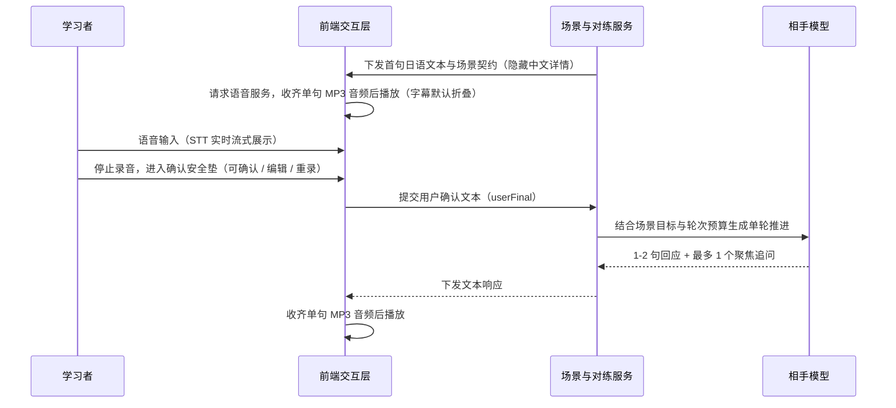
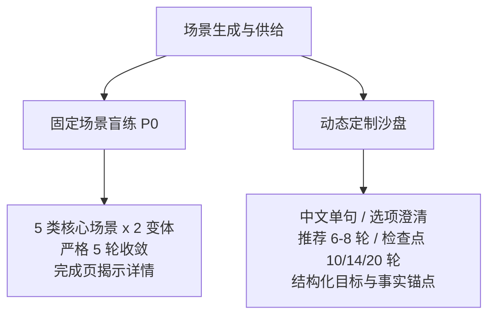
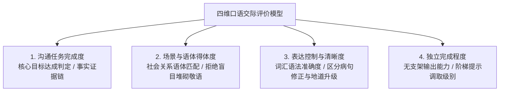
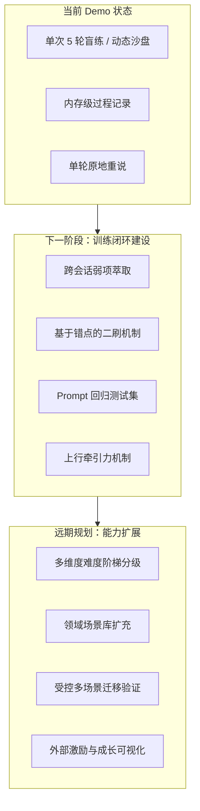
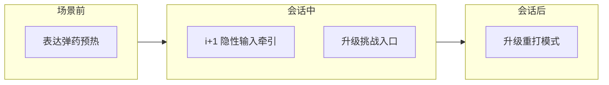
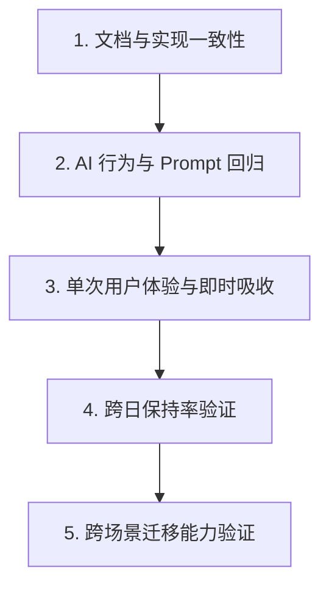

# KaiwaDemo 产品说明书与演进规范

> **文档性质**：产品基线说明书与演进约束规范 
> **文档版本**：Product Baseline v2.0 
> **实现基线**：本次审阅时的当前仓库工作区状态 
> **目标用户**：具备 JLPT N2 相当级别词汇与语法储备、但在实际交际中存在开口阻塞的中文母语日语学习者 
> **核心定位**：低心理负荷、半双工回合制、目标驱动的场景化口语输出训练系统

## 一、 产品定位与服务对象

### 1. 目标人群特征
- **知识储备**：掌握中高级词汇与语法规则，具备相应的阅读理解与听力应试能力（约 JLPT N2 相当水平）。
- **核心痛点**：在实际口语交流中存在“中文构思 -> 逐词翻译 -> 语法校验 -> 开口受阻”的认知通路延迟；在即时会话中担心犯错、难以调用恰当语块、对语境得体度（敬体/简体/委婉表达）缺乏把握。
- **能力边界界定**：JLPT 等级仅作为词汇和语法难度的参考锚点，本产品不提供口语能力等级认证。

### 2. 核心价值主张
旨在将不可控的自由闲聊改造为“高聚焦、低压力、可干预、可追溯”的沙盒对练。核心设计目标是通过明确场景契约、结构化阶梯提示和安全垫机制，降低即时社交焦虑，辅助学习者探索缩短从认知到表达调用延迟的路径，逐步建立情境化口语输出习惯。

## 二、 状态分类与能力矩阵

为消除文档与代码实现的漂移，所有功能与机制严格划分为六类状态：

| 状态类型 | 定义与边界 | 包含模块与特性 |
|---|---|---|
| **稳定产品原则** | 贯穿产品始终的核心交互哲学与设计底线 | 半双工回合制、转写确认、克制相手、阶梯提示、集中复盘、立即重说 |
| **当前已实现能力** | 已在当前 Worker/Web 端代码中落地并可运行 | 5 类 P0 固定场景（各 2 变体）盲练；场景完成页揭示；固定场景严格 5 轮；动态场景推荐 6 至 8 轮，初始上限 10 轮，检查点可延长至 14 或 20 轮；4 级阶梯提示；结构化复盘与单轮重说；内存指标埋点 |
| **部分实现** | 核心流程可用，部分字段缺少语义枚举与一致性约束 | 动态场景生成（JSON 结构中 tone、hintStrategy、feedbackFocus 仍为语义自由文本，缺少枚举与语义约束） |
| **规划中** | 下一阶段演进重点，聚焦训练闭环建设 | 本地/云端跨会话历史持久化；弱项萃取与针对性二刷；Prompt 回归评测集；动态场景字段收敛为受控枚举或明确语义规则；「说得对吗」急救抽屉（意图对齐与撤回重说）；上行牵引力机制（i+1 隐性输入牵引、升级挑战入口、场景前弹药预热、升级重打模式）；外部激励体系（构想阶段，依赖用户系统与评价体系纵向对比能力） |
| **明确不做** | 当前及可预见阶段明确排除的方向 | 抢话式全双工通话；会话中即时打断纠错；纯自由闲聊模式；发音/音调/重音打分（当前及可预见阶段明确非目标，需独立验证声学可靠性后方可重新评估）；过早铺设 N5 至 N1 全等级矩阵；过早支持多母语 |
| **待验证假设** | 核心教学假设，需通过受控测试与数据证伪 | 转写安全垫低压力、阶梯提示减少退出、立即重说当场改善、跨日保持与跨场景表达迁移假说、上行牵引力驱动表达升级假说 |

## 三、 核心交互哲学与训练机制（稳定产品原则）

### 1. 半双工回合制（Turn-based Semi-Duplex）
坚决不采用抢话式全双工双向实时通话。
- **听与说解耦**：学习者在听懂相手发话后拥有自主思考时间，消除即时接话的社交压迫感。
- **节奏自主可控**：支持反复重听相手发话、按需展开日语字幕，降低听力瞬间过载风险。

### 2. 转写确认安全垫（Transcript Safety Net）
- **纠错与防误触**：用户录音结束后必须经过确认、修改或重录阶段，确认前绝不触发后端对话模型。
- **纯净文本入模**：前端只对明确填充音、机械重复和格式噪声做确定性轻整理，同时保留原始转写（userOriginal）与最终确认稿（userFinal）。
- **评价依据边界**：由于当前未接入声学音素分析，系统所有语法、自然度与目标评价均严格基于 `userFinal` 文本。

### 3. 克制相手原则（Restrained Interlocutor）
- **拒绝好为人师**：对话进行中 AI 严禁以教师身份打断会话或纠正语法，必须始终沉浸在角色设定内。
- **信息密度克制**：AI 单次回话严格限制为 1 至 2 句自然日语，每次最多提出 1 个具体问题，禁止多重提问。
- **目标驱动收敛**：在轮次预算内根据用户输入自然推进，达成目标或到达轮次上限时自然收束。

### 4. 4 级阶梯式提示（Graded Hint）
当用户表达卡壳时，可自主调取渐进式支架，避免直接跳出查词典导致心流中断：
- `Level 1`（方向指引）：提供中文表达思路与逻辑要点。
- `Level 2`（核心语块）：提供 2 至 3 个适合当前情境的日文关键词或短语。
- `Level 3`（句式起手）：提供接话前半句或句型框架。
- `Level 4`（完整例句）：提供地道完整的母语者参考表述。

### 5. 集中复盘与立即重说（Review & Immediate Retry）
- **会话后集中交付**：对话过程中不干扰，结束后由独立 Prompt 基于全局上下文生成结构化复盘。
- **复盘维度**：包含目标达成判定（isGoalCompleted）、2 项具体亮点（strengths）、1 至 3 项语法或自然度改进（improvements，必须引用用户实际发话）、2 项可复用句型（reusableExpressions）、1 项达人升级表达（masterUpgrade）。
- **立即重说（Immediate Retry）**：挑选全场最关键的一个改进轮次，提供推荐参考句，让用户在原情境下当场重说一次，完成单次训练即时强化。

## 四、 场景供给形态与训练契约

### 1. 双轨场景供给现状
- **固定场景盲练（当前已实现）**：
  - 收录 5 类高频 P0 场景，每类包含 2 个变体：
    1. `weekend-chat`（周末闲聊：同事茶水间 / 周一晨间寒暄）
    2. `order-change`（点单变更：餐厅菜品售罄 / 咖啡规格调整）
    3. `schedule-change`（日程调整：工作会议改期 / 预约时段协调）
    4. `work-progress`（工作进展：进度汇报 / 截止日前风险沟通）
    5. `conversation-repair`（会话修复：重听会议安排 / 确认预约信息）
  - **盲练机制**：练习开始前不展示中文场景说明，学习者完全依靠相手首句日语推断语境与角色，模拟真实突发交际；会话完成后在完成页统一揭示。
  - **固定轮次**：严格固定为 5 轮对话。
  - **远期规划说明**：原概念规划的 5 大领域 26+ 场景目录属于远期内容规划，当前未实现。
- **动态场景沙盘（当前已实现基础链路）**：
  - 学习者输入一句话中文需求（如“明天要向日本房东确认退租扣款明细”）。
  - 需求明确时直接生成；需求模糊时最多触发 2 次选项澄清（每次 1 个问题 + 2 至 4 个选项）。
  - 动态场景推荐 6 至 8 轮；初始上限 10 轮；在第 10 轮检查点若目标未达成可延长至 14 轮或 20 轮。
  - 现状说明：动态场景虽然已有固定 JSON 字段与 TypeScript 类型，但 tone、hintStrategy、feedbackFocus 目前仍为模型生成的语义自由文本、缺少语义枚举与一致性约束，下一阶段需收敛为受控枚举或明确语义规则。

### 2. 人机训练契约（Training Contract）
为保障训练质量与安全性，系统建立明确的契约分工：
- **产品与工程团队契约**：定义场景边界、轮次上限、安全准则、评估规则、版本标识及回归评测基准。
- **AI 相手生成契约**：以给定角色、初始事实锚点（worldAnchors）和安全边界（safetyBoundary）为基准组织语言；初始锚点并非封闭事实集，AI 可在低风险范围内补充符合常理且前后一致的虚构细节（如架空人物、非敏感背景），但不得超出范围承诺外部现实操作，严禁索取个人隐私与敏感信息。

## 五、 四维评估模型与过程证据

当前阶段不采用单一百分制或单一综合打分，采用四维能力评估模型，并结合过程埋点作为客观证据，避免过早引入未经充分校准的虚假精确分数。

### 1. 四维能力评估维度
1. **沟通任务完成度（Task Completion）**：
   - 核心交际目标是否达成（如改期是否相互确认候选时间、退租是否问清款项明细）。
   - 判定输出：`isGoalCompleted`（布尔值）及基于发话事实的证据链（evidence）。
2. **场景与语体得体度（Pragmatic & Register Appropriateness）**：
   - 考察用语风格是否匹配双方社会关系（同事/店员/上级/客户）与场合。
   - **语体原则**：更多敬语绝不等于更高水平。与平级同事过度使用敬语属于失当；得体性评价以“语境恰当”为唯一准绳。
3. **表达控制与清晰度（Expressive Control）**：
   - 基于 `userFinal` 文本分析词汇与语法准确度、搭配自然度，以及受中文迁移影响的中式日语。
   - 区分语法错误（grammar_fix）与地道升级（naturalness_upgrade）。
4. **独立完成程度（Independence Level）**：
   - 评估学习者在无支架状态下的自主输出能力。
   - 以提示调取级别（hintLevelUsed: 0-4）和调取频次作为直接证据。

### 2. 过程指标作为证据而非机械扣分
系统采集以下过程指标用于分析学习者认知状态，绝不将其作为直接扣分公式：
- **开口延迟（Speech Start Latency）**：只在相同设备、场景难度和输入条件下作为信息处理与组织速度的相对代理指标，不能单独用于判定口语能力。
- **转写修改次数与重录次数（Modification & Rerecord Counts）**：可能受环境噪声、发音口音或 STT 识别偏差影响，不能直接推断为语言表达能力缺陷，仅作为交互摩擦力与表达流畅度的辅助参考。
- **提示调取记录（Hint Usage）**：定位具体认知卡点。
- **重说完成情况（Retry Task State）**：衡量单次反馈吸收度。

## 六、 演进规划与分级体系（规划中）

### 1. 跨会话学习闭环（下一阶段重点）
当前 Demo 数据仅留存于页面内存，刷新即丢失。下一阶段将构建“练习 -> 萃取 -> 巩固 -> 迁移”闭环：
- **弱项特征库**：自动沉淀高频语法偏误、语体失当点及高依赖提示场景。
- **同场景针对性二刷**：重练时动态调整相手策略，针对历史弱项发起变式追问。
- **跨场景迁移验证**：在全新场景中检验历史复用句型与纠错点是否已被自然调用。

### 2. 「说得对吗」急救抽屉（备忘 / 规划中）
针对学习者在会话中“不知道自己说得对不对”以及“担心 AI 理解偏差导致会话脱轨”的真实顾虑，系统规划在 UI 层引入与对话流物理隔离的急救抽屉（Bottom Sheet），形成轻量级即时兜底：
- **触发机制与非阻塞加载**：在用户发话气泡旁提供低饱和度线性入口（如「💡 表达解析」）。默认不请求，用户主动点击后异步拉取，绝不增加主对话流与语音播放的等待延迟。
- **三大核心模块**：
  1. **相手理解的意图**：用 1 句中文概括 AI 实际捕获的核心意图，让学习者一眼识破交流是否产生偏差。
  2. **地道升级参考**：提供 1 句母语者推荐说法与 1 句关键得体度点拨，不铺陈冗长语法规则。
  3. **逃生通道（一键撤回重说）**：若发现意图被严重误解或希望当场换用地道句式，允许撤回本轮发话并重新作答，防止后续轮次脱轨。
- **与会话后集中复盘的分工**：
  - *气泡急救抽屉*：局限于单轮局部，专注于"意图核对、急救参考与失误回滚"；
  - *会话后集中复盘*：立足于全场全局，专注于"目标完成度、多维表现、弱项沉淀与肌肉记忆重说"。

### 3. 上行牵引力机制（规划中）

**问题诊断**：当前系统的核心机制（安全垫、阶梯提示、克制相手）全部服务于"降低门槛"，有效解决了开口焦虑问题。但对于口语水平较低的学习者，仍然存在"不知道更好的表达长什么样"的认知盲区——降低门槛不等于创造向上的拉力。学习者倾向于反复使用已掌握的简单句式完成任务，缺少探索更复杂表达的动机与参照。

**设计原则**：在会话生命周期的不同阶段植入"上行牵引"，让学习者持续感知到"还能说得更好"，且每一步都有可触达的参照句式，而非抽象的"提高水平"要求。

#### 3a. i+1 隐性输入牵引（Comprehensible Input Scaffolding）
- **核心理念**：基于 Krashen 的 i+1 假说，AI 相手在不破坏"克制相手"原则的前提下，有意识地在回话中使用略高于用户当前输出水平的表达。用户通过反复听到这些表达，逐渐内化为自己的产出能力。
- **实现层**：纯 Prompt 调整，零前端改动。在相手推进 Prompt 中增加语言策略指令：根据用户前序发话的语体水平与句式复杂度，在 AI 回话中自然嵌入用户"应该知道但没有在用"的句式（如用户一直用 `〜てもいいですか` 时，AI 自然使用 `〜ていただけると助かります`）。
- **边界约束**：AI 回话仍严格限制 1 至 2 句、最多 1 个追问；i+1 策略仅影响遣词造句的复杂度与语体层级，不增加信息密度或对话压力。
- **验证优先级**：最高。成本最低，可立即通过 A/B Prompt 对比观测用户后续轮次是否出现模仿行为。

#### 3b. 升级挑战入口（Upgrade Challenge）
- **核心理念**：在用户发出"能用但平淡"的表达后，UI 侧提供非阻塞的升级入口，展示同一意图的更地道说法，让用户选择是否当场尝试。
- **触发条件**：用户发话被后端判定为"语法正确、目标达成，但存在明显的地道度提升空间"时触发。判定逻辑可复用现有 rescue 抽屉的意图解析管线。
- **UI 形态**：与现有 rescue 抽屉（「💡 表达解析」）同构的低调入口（如「✨ 试试更地道的说法？」），点击展开后展示：升级版句式 + 一句中文要点解释。用户可选择"记住了，下次试"（仅标记）或"现在重说"（触发当轮重录流程）。
- **与克制相手的关系**：升级建议由独立 UI 组件提供，不由 AI 相手角色发出，不破坏角色沉浸。
- **依赖**：需新增后端判定端点（或扩展现有 rescue 端点）；前端增加气泡附属入口组件。

#### 3c. 场景前表达弹药预热（Pre-session Expression Primer）
- **核心理念**：在场景开始前（或 AI 首句发话后的思考阶段），向用户展示 2 至 3 个"本场景可能用到的关键表达"，让用户在开口前就知道高级表达长什么样。类似游戏进入副本前的装备推荐。
- **展示内容**：每条包含日语句式 + 中文释义 + 适用语境一句话说明。不提供完整对话模板，避免用户照搬。
- **来源**：固定场景从场景定义中预置；动态场景由场景生成 Prompt 同步输出。
- **UI 形态**：场景契约建立阶段的可折叠卡片，用户可选择跳过。
- **依赖**：固定场景需扩展 ScenarioVariantDefinition 增加 `expressionPrimer` 字段；动态场景需扩展 DynamicScenarioDefinition 的生成 Schema。

#### 3d. 升级重打模式（Upgrade Replay）
- **核心理念**：在会话后复盘阶段，不仅提供纠错重说（现有 retryTask），还提供"全场升级视角"——为用户每一轮发话展示升级版参考句，用户可选择性重说任意轮次。
- **与现有 retryTask 的分工**：retryTask 聚焦"最关键的一个纠错点"；升级重打聚焦"表达从能用到地道的整体提升"。
- **实现复杂度**：需扩展 FeedbackResponse 增加逐轮升级建议字段，前端需支持多轮选择性重说 UI。工作量最大，建议在前三项验证通过后再启动。
- **依赖**：复盘数据结构扩展、多轮重说的前端交互设计。

#### 实施优先级与验证路径

| 顺序 | 方向 | 改动范围 | 验证方式 |
|------|------|----------|----------|
| 1 | 3a i+1 隐性牵引 | 纯 Prompt | A/B 对比：观测用户后续轮次是否出现 AI 用过的句式 |
| 2 | 3b 升级挑战入口 | 后端端点 + 前端组件 | 点击率、"现在重说"选择率、重说后表达质量 |
| 3 | 3c 预热弹药 | 场景定义扩展 + 前端卡片 | 预热后首轮发话复杂度是否高于无预热对照组 |
| 4 | 3d 升级重打 | 复盘结构扩展 + 多轮重说 UI | 升级重说完成率、跨会话表达迁移率 |

#### 远期：外部激励体系（构想阶段）
上行牵引力机制为外部激励提供了"进步"的量化基础。外部激励体系的建设依赖以下前置条件成熟：
- **评价体系纵向对比能力**：需跨会话持久化落地后，才能量化"上周用 `すみません`，本周自然说出 `恐れ入りますが`"的进步轨迹。
- **用户身份系统**：无持久身份则无积累感，streak / 解锁 / 成长曲线均无从附着。
- **可能的激励形态**（仅作备忘，尚未设计）：表达升级历史时间线、场景通关 mastery badge、个性化弹药推荐、成长曲线可视化。
- **启动门槛**：至少 3a 与 3b 落地并验证"用户确实会尝试更复杂的表达"这一行为假设后，方可进入激励体系设计。在此之前，堆砌激励机制属于在未验证方向上浪费工程资源。

### 4. Prompt 版本化与行为回归验证
为所有 Prompt（场景生成、相手推进、阶梯提示、检查点、复盘生成）建立严格语义版本号，并建立标准 Golden Case 回归集，在模型升级或 Prompt 调整时通过三层校验进行行为回归验证：
- **Schema 与硬规则断言**：校验 JSON 结构、相手回话是否满足 1 至 2 句且最多 1 个聚焦提问、improvements 引用是否严格来自 userFinal 文本。
- **基于 Rubric 的模型预筛**：使用独立评测模型比对输出与评分准则的一致性。
- **人工抽样复核**：对边界用例和典型场景进行定期人工审核。

### 5. N5 至 N1 难度分级设计指引
JLPT 等级仅作为词汇与语法范围的参考锚点，并不等同于官方口语等级标准。口语训练难度由四个控制维度综合调节（各维度在实际运用中可能相互影响），严禁将敬语使用量机械等同于口语水平：
1. **语言预算（Language Budget）**：目标词汇量与句式复杂度（从基础动词变形到复杂从句）。
2. **任务复杂度（Task Complexity）**：从单一信息获取（如问路、结账）到多约束协商与利益沟通（如日程协调、诉求确认）。
3. **互动负担（Interaction Load）**：相手信息密度、说话意图隐藏度及对即时回应的灵活性要求。
4. **支持强度（Scaffolding Strength）**：默认提供的提示深度与澄清容忍度。

基于上述四个控制维度的难度映射参照：
- **N5 参照**：低语言预算、单目标信息交换（如便利店结账、基础问路）、极低互动负担、高支持强度。
- **N4 参照**：基础日常句式、简单条件与因果表达（如商品退换、日常请假）、低互动负担。
- **N3 参照**：中等语言预算、包含初步委婉与理由说明（如餐厅个性化要求、轻微不适就医）、中等支持强度。
- **N2 参照（当前基准）**：复合表达、多方诉求协商与适度委婉留白（如会议改期协调、租房条款确认）、低支持强度。
- **N1 参照**：高语言预算、高语境博弈与精细立场表达（如商务协商沟通、复杂争议处理）、极低支持强度。

### 6. 语体训练维度
语体是日语口语成熟度的核心标志。日语语体系统并非单一维度的线性升级，而是多重语言机制在特定社会语境中的得体组合。产品将语体训练解构为以下核心维度：
- **人际关系与社会距离**：对话双方的社会距离（亲疏、内外、上下关系）决定了整体用语策略。
- **基础文体选择**：常体（简体，如 だ/する）与礼貌体（丁寧体，如 です/ます）的基础选择与场景一致性。
- **敬语功能组合**：
  - **丁寧語**：通过 です/ます/ございます 等形式对听话人表示礼貌。
  - **尊敬語（抬高对方）**：抬高对方或第三者的动作、状态与所有物（如 いらっしゃる/おっしゃる/お〜になる）。
  - **謙譲語（降低自身）**：降低自身或己方动作以表达敬意（如 伺う/申し上げる/お〜する）。
  - *说明*：尊敬语与谦让语服务于不同交际功能且可在同一句中复合使用，并非互斥两极。
- **直接度与缓冲策略**：根据交际阻力调节表达的直接性与缓冲强度（如：直接请求「確認してください」 vs 委婉商量「ご確認いただくことは可能でしょうか」；直接拒绝「できません」 vs 缓冲留白「あいにく対応いたしかねます」）。
- **训练目标**：训练的核心在于根据角色关系实现情境得体（Appropriateness）与在不同语境间的稳定切换，杜绝脱离关系的敬语堆砌。

### 7. 边界约束与阶段节制
在跨日保持率和跨场景迁移效果未获得充分实证数据前，产品团队坚决执行以下节制原则：
- **暂不扩张多母语**：优先服务中文母语学习者的典型负迁移问题（如汉字词误用、逻辑连接词过载）。
- **暂不扩张全等级**：做深 N2 痛点并跑通闭环，避免盲目铺设 N5 至 N1 浅层内容。
- **明确不设发音打分**：发音与声学评分属于当前及可预见阶段的明确非目标。在未独立验证低信噪比与非母语口音识别的声学可靠性前，不设立项，杜绝误导性评分。

## 七、 验证体系、可证伪假设与决策门槛

产品构建覆盖五层层级的验证体系，并将未经验证的主观判断转化为可证伪假设：

### 1. 五层验证体系覆盖

1. **文档与实现一致性**：对照当前代码与接口定义，确保文档状态标签与实现完全同步，杜绝超前口径。
2. **AI 行为与 Prompt 回归**：基于 Golden Case 执行 Schema 断言、规则校验、Rubric 模型预筛与人工抽样。相手短句限制（1 至 2 句）与单追问限制属于系统硬性行为契约，纳入 AI 回归自动化断言门槛（违规率 0%）。
3. **单次用户体验与即时吸收**：验证单场练习完练率、安全垫低压力体验与即时重说改善效果。
4. **跨日保持率验证**：使用等价题面与受限提示基准测试，跟踪 24 至 48 小时后对目标表达的保持情况。
5. **跨场景迁移能力验证**：更换表面场景但保持相同沟通功能与语体，检验目标表达的自主调用率。

### 2. 核心可证伪假设与决策门槛

下表中的百分比指标均为**首轮建议决策门槛，需用首批测试校准**：

| 编号 | 核心假设 | 测量方法与数据源 | 验证标准与决策门槛 [首轮建议门槛，需用首批测试校准] | 验证未达标应对措施 |
|---|---|---|---|---|
| **H1** | **安全垫低压力假设**：半双工与转写确认安全垫能有效降低开口焦虑，维持会话完成意愿。 | 结合受测者完练记录、课后自评量表（开口焦虑感、控制感、继续练习意愿）与操作模式记录。[数据源限制说明：当前 SessionReport 与页面导出主要覆盖完练流程，中途放弃率当前需依赖 user-test-template 人工测试记录；规模化验证前需增加 session start 与 abandon 事件埋点] | 会话正常完练率 >= 80%；70% 以上受测者在自评中认可转写确认提供了表达控制感并愿意继续使用。 | 优化确认浮层交互路径，降低编辑与重录摩擦。 |
| **H2** | **阶梯提示防流失假设**：结构化阶梯提示能在用户卡壳时提供即时支架，减少中途放弃。 | 统计调取提示后的单轮有效回答生成率、后续轮次继续率及完练情况；核查调取 Level 1 至 3 后自主组织发话的比例，区分自主组织与直接引用 Level 4。[数据源限制说明：中途退出数据当前依赖人工测试记录，现有 SessionReport 无法单独提供完整流失率统计，规模化前需补充前端流失事件采集] | 调取提示后产生有效发话并继续进入下一轮的比例 >= 75%，且能够顺利完成后续对话。直接照抄 Level 4 完整例句的行为不计为独立表达能力提升。 | 调整 Level 1 至 2 提示的相关性与引导粒度，降低对 Level 4 完整句的依赖。 |
| **H3** | **立即重说当场改善假设**：集中复盘后对关键轮次立即重说，能当场提升该轮表达的准确性与得体度。 | 在单次会话页面内比对同一轮次的初次确认发话（userFinal）与重说最终文本（retryFinalText），按预设 Rubric 进行配对评估（语法正误、语境得体度）。[数据缺口说明：当前 retryFinalText 仅留存于页面本地状态，尚未写入 SessionReport 或持久化存储，正式实证前需先补充该字段导出能力] | 在具备导出数据的测试样本中，重说最终文本（retryFinalText）在 Rubric 得分上较初次发话正向改善率 >= 60%。 | 重构 retryTask 推荐句与提示词，明确重说针对的单一改进点。 |
| **H4** | **跨日保持假设**：单次训练获得的表达控制能力可在 24 至 48 小时后得到保持。 | [当前依赖项：跨会话持久化、等价题面库与受限提示基准尚未实现，当前仅作为验证协议规范，无法从现有内存 SessionReport 直接得出结论] 在 24 至 48 小时后引入等价题面（相同交际功能、相同难度但不同表面信息）进行受限提示基准测试，比对前序会话 improvements 对应知识点的掌握情况。 | 等价题面测试中历史改进知识点的正确调用率 >= 40%。 | 缩短复习间隔，引入轻量化微场景召回训练。 |
| **H5** | **跨场景迁移假设**：在训练中掌握的语体策略与核心表达能够迁移至未见过的全新情境中。 | [当前依赖项：依赖跨会话持久化与迁移测试用例集建设，当前属于协议规范] 更换表面场景但保持相同沟通功能与目标语体，检查 userFinal 文本中交际任务达成情况与语体得体度。 | 在新场景测试中，沟通任务完成率 >= 70%，且在无高阶提示依赖下语体得体度达标；前序学过的得体表达仅作为自发调用的佐证之一，不作为机械必现门槛。 | 在复盘中强化可复用句型（reusableExpressions）的适用语境边界讲解。 |
| **H6** | **上行牵引力假设**：在会话中提供 i+1 隐性输入与升级挑战入口，能驱动学习者主动尝试超出舒适区的复杂表达。 | 对比启用 i+1 策略前后，用户在相同场景类型中的表达复杂度变化（句式种类数、平均句长、语体层级）；统计升级挑战入口的点击率与"现在重说"选择率。[当前依赖项：3a i+1 Prompt 策略落地后方可启动 A/B 对比；3b 升级挑战入口需前后端开发完成] | 启用 i+1 策略后，用户后续轮次中出现 AI 曾用过的高阶句式的比例 >= 20%；升级挑战入口点击率 >= 30%，其中选择"现在重说"的比例 >= 15%。 | 调整 i+1 策略的语体差距幅度（过大则用户跟不上，过小则无牵引效果）；优化升级挑战入口的触发时机与展示方式。 |

## 八、 验收与演进自检清单

在每次产品迭代或 Prompt 调整时，必须依照以下清单进行规范符合性自检：

- [ ] **实现一致性**：文档中所述已实现特性是否在代码库中均有对应实现，无超前描述。
- [ ] **交互原则遵从**：是否存在抢话、会话中即时打断纠错或多重追问的破缺设计。
- [ ] **评价边界清晰**：复盘与评价是否完全基于 `userFinal`，无虚假声学打分。
- [ ] **过程证据完备**：SessionReport 是否完整记录轮次、耗时、重录、修改与提示数据。
- [ ] **数据与证据就绪**：学习效果验证所需的数据指标（如重说文本 retryFinalText、跨会话记录）是否已真实采集并支持导出；在缺少必要埋点或持久化支持时，不得宣称已完成实证验证。
- [ ] **版本与回归健全**：Prompt 变更是否同步维护版本号并在 Golden Case 集完成三层回归验证。
- [ ] **演进边界守卫**：是否抵制了在未验证核心假设前盲目扩张等级、母语与声学打分的冲动。
- [ ] **上行牵引力守卫**：i+1 隐性牵引是否严格遵守克制相手原则（1 至 2 句、最多 1 个追问）；升级挑战入口是否由独立 UI 组件提供而非 AI 角色发出；外部激励体系是否在行为假设（H6）验证通过前保持构想状态。
