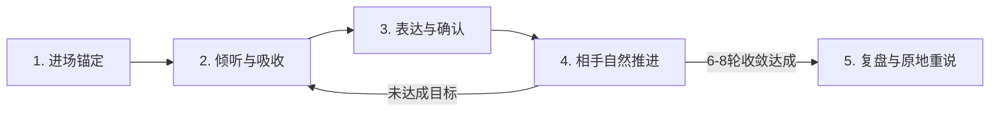
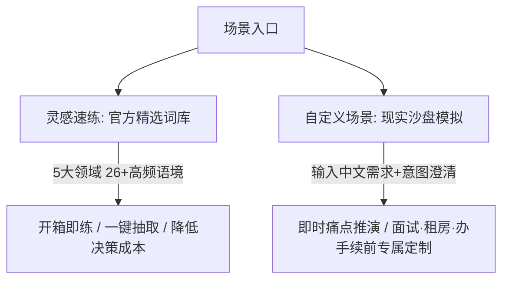

# KaiwaDemo 产品形态与体验设计说明书

> **版本**：Product Concept v1.1 (Pure Product & UX Specification)  
> **定位**：面向 JLPT N2 学习者的低压力、高频次、自适应日语口语训练产品  
> **核心机制**：半双工回合制交互（Turn-based Semi-Duplex）

---

## 一、 用户核心矛盾与产品定位

### 1. 核心矛盾：为什么 N2 学习者“会日语，但说不出”？
中文母语的 N2 学习者通常已储备了大量的词汇与语法规则，但在实际口语交际中存在严重的**认知通路阻塞**：

```
传统困难路径：输入日语 -> 翻译成中文理解 -> 用中文想好回答 -> 翻译成日语句子 -> 开口说（卡顿、高延迟、句式生硬）
理想习得路径：输入日语 -> 触发情境反应 -> 直接调用日语语块（Chunks） -> 开口说（低延迟、自然即时反应）
```

**导致开口难的三大现实阻碍**：
1. **社交评价压力**：真人对话存在容错成本，一旦卡壳或说错容易产生尴尬与挫败感，导致越来越不敢开口；
2. **知识碎片化脱节**：背过的词汇和语法是静态孤立的，在具体情境下不知道面对特定身份角色时最自然的第一反应；
3. **缺少即时正反馈与肌肉记忆巩固**：自由聊天说完就过，不知道哪句地道、哪句生硬；课后改错往往严重滞后，无法当场转化为口语肌肉记忆。

### 2. 产品解决方案
打造一个**低心理压力、高响应频次、可反复推演重练**的日语口语沙盒：
- 采用**半双工回合制交互**，给学习者留出充足的思考、组织与确认空间；
- 通过**情境预设 + 语弹赋能 + 相手克制交互 + 教学级即时复盘 + 原地重说**，形成完整的单次口语训练闭环。

---

## 二、 核心交互哲学：半双工机制（Turn-based Semi-Duplex）

坚决不做抢话式、强打断的实时全双工双向通话。

| 交互维度 | 全双工双向通话（不采用） | 半双工回合制（本产品核心） |
|---|---|---|
| **认知负荷** | 极高，需要同时处理听力、即时打断与抢话 | 可控，听懂与表达两阶段清晰分开 |
| **心理门槛** | 容易慌乱、害怕停顿导致冷场 | 留有呼吸与组织语言的心理缓冲空间 |
| **输出质量** | 随口应付，容易退化为单个词或极短句 | 支持在发送前检查、微调转写或推倒重录 |
| **训练定位** | 偏向无序的深水区实操 | 偏向科学、系统、扎实的口语力量训练 |

---

## 三、 单次训练的核心体验闭环（5 阶段模型）



### 1. 进场锚定（Context & Ammo）
拒绝让用户在“空白状态”下漫无目的地自由闲聊。每次对话前提供清晰的心理锚点：
- **场景环境**：明确身处何地（如：公司休息室 / 居酒屋 / 不动产中介 / 银行柜台）；
- **对方角色**：明确对方是谁、性格与关系（如：礼貌但语速较快的店员 / 关系普通但友好的日本同事），锁定恰当的敬语/简体语境；
- **核心挑战**：明确本场交流需要达成的核心目标（如：委婉拒绝加班要求 / 询问租房初期费用明细）；
- **场景语弹（Key Expressions）**：提前给用户 2~3 个适合该情境的 N2 高频地道表达，让用户心里有底。

### 2. 倾听与吸收（Listen & Absorb）
- 相手（AI 对话伙伴）说出第一句自然日语台词；
- 默认播放拟真语音，支持展开/收起日文字幕，支持单句反复重听；
- 倒计时与状态指示清晰，避免给用户造成催促感。

### 3. 表达与确认（Express & Confirm）
- **双模输入自由切换**：支持点击麦克风进行语音输入，也支持在不便开口的环境下切换为键盘打字；
- **转写驱动的实时反馈**：说话时实时展示大字号、多行自适应的转写内容与动态光标；
- **转写确认安全垫（Safety Net）**：
  - 录音结束后唤起确认浮层；
  - 用户可确认无误后直接发送；
  - 允许直接修改个别助词/识别偏差，或一键重新录制；
- **阶梯式求助（4-Level Graded Hint）**：
  - 真正卡壳时无需退出查字典，可随时点击获取渐进式提示：
    - `Level 1`：思路方向引导（中文）
    - `Level 2`：关键日文词块
    - `Level 3`：接话前半句
    - `Level 4`：完整母语者参考例句

### 4. 相手的克制交互（Restrained Interaction）
- 扮演真实情境中的日本对话对象，**坚决不当好为人师的纠错老师**；
- 在对话进行中绝不断然打断或指出语法错误，优先保障会话的流畅流动；
- 严格遵循生活规律：**一次只说 1~2 句话，每次最多追问 1 个具体问题**；
- 目标驱动推进：在 6~8 轮之间根据核心挑战的完成情况自适应自然收敛结束。

### 5. 即时复盘与原地重说（Review & Immediate Mastery）
会话结束后提供结构化、极少废话的教学复盘：
- **表现出色（Strengths）**：明确肯定刚才表达中最地道、用词最准确的 2 处，强化信心；
- **地道升级（Improvements）**：挑选 1~2 处中式日语或语法生硬处，指出原因并提供母语者的推荐说法；
- **复用句型（Reusable Expressions）**：提炼本场对练中最值得固化迁移的 2 个句型结构；
- **原地重说（Immediate Retry - 核心动作）**：
  - 针对最需要改进的一轮，让用户当场使用推荐的地道句型再读/说一遍；
  - 形成“初次回答 vs 重说回答”的直观比对，**当场把知识点压入肌肉记忆**；
- **二刷对比（Trend Comparison）**：记录历史对练数据，在同场景二次挑战时展示流畅度与表达丰富度的成长变化。

---

## 四、 场景供给形态：双轨驱动



1. **灵感速练（Spark Practice）—— 每日口语健身房**
   - 覆盖 5 大核心领域：日常消费与服务、职场协作与商务、突发故障与求助、社交与日常闲聊、生活手续与契约；
   - 预设 26+ 个深度打磨的情境，每个场景固化 4 维要素，支持一键抽卡与即刻开练。
2. **自定义场景（Custom Scenario）—— 现实沙盘推演**
   - 满足用户现实中的紧急对话需求（如：“我明天要跟日本房东谈退押金”）；
   - 输入一句话中文需求，系统进行意图理解与选项澄清，秒级生成专属沙盘。

---

## 五、 视觉与体验风格准则

1. **反 AI 廉价感（Anti-AI Slop）**：
   - 采用温润纸面（Canvas）、深墨文字（Ink）、克制朱红与抹茶绿点缀；
   - 全站杜绝 Emoji 与花哨插画，全部使用统一的线性 SVG 图标；
2. **移动端手势与视口优化**：
   - 底部操作栏严格避让 iPhone 底部横条与 Safari 工具栏；
   - 顶部布局充分避让 iPhone 灵动岛与状态栏，中文字体行高充盈无切顶；
3. **尊重无障碍与减少动态效果（A11y）**：
   - 高频操作无冗余动画，状态切换仅采用轻微淡入；
   - 严格响应系统的 `prefers-reduced-motion` 设置。
