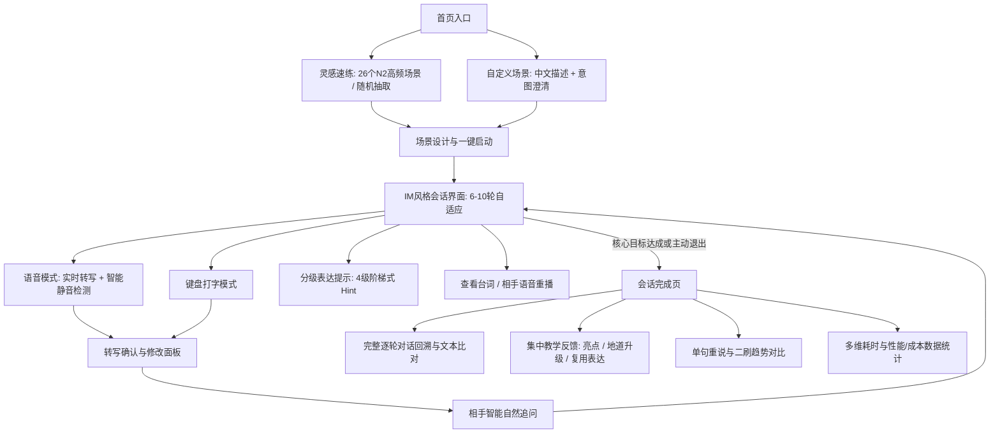

# KaiwaDemo 产品与技术形态总结

> **版本**：Prototype v1.0 (End-to-End Proof of Concept)  
> **更新时间**：2026-09-03  
> **定位**：面向 JLPT N2 学习者的低压力、高频次、自适应日语口语训练端到端原型

---

## 一、 项目背景与核心需求

### 1. 目标人群画像
- **语言水平**：达到 JLPT N2 左右，具备较为扎实的词汇、语法和听力基础；
- **核心痛点**：
  1. **思考慢、翻译感强**：听到日语后无法快速组织语言，习惯先在脑中构思中文再翻译；
  2. **缺少对话环境与开口恐惧**：害怕在真实交流中犯错，传统真人外教课或语言交换成本高、心理负担重、频次不足；
  3. **普通自由聊天收效甚微**：缺乏明确的情境目标、场景锚点与系统性反馈，练习难以转化为即时调用的口语能力；
  4. **传统发音评分的误伤**：音素级机械打分经常将口音或识别偏差误判为语法/语言错误，挫败学习信心。

### 2. 产品解决切入点
- 提供一个**低心理压力、高响应频次、支持随时重练**的真实情境沙盒；
- 采用**“回合制半双工 + 实时转写确认”**机制，将“机器识别错”与“用户表达错”解耦；
- 结合大语言模型的意图推进与 ElevenLabs 高拟真语音，在 6~10 轮自然对话中完成自适应目标练习与会话后集中复盘。

---

## 二、 核心设计哲学与安全边界

| 维度 | 设计决策 | 说明 |
|---|---|---|
| **交互模式** | 回合制半双工（Turn-based） | 不做抢话式双向通话，降低认知负荷，保证输出可控与用户思考空间 |
| **视觉风格** | 工具化极简审美（Anti-Slop） | 暖灰纸面、深墨文字、朱红状态色；全站使用 SVG 矢量图标，杜绝 Emoji 与花哨营销化装饰 |
| **移动优先** | 适配 iPhone Safari 与灵动岛 | 针对 iOS 状态栏、安全区（Safe-Area）、底部手势条及音频手势上下文进行深度适配 |
| **安全与隐私** | Cloudflare Access + 边缘代理 | 全站与 API 受白名单保护；永久 API Key 仅存于 Worker Secrets，前端仅使用单次临时 Token；不落库保存用户音频 |

---

## 三、 完整产品功能形态

### 1. 场景发现与启动（双模式）
- **灵感速练（Spark Practice）**：
  - 内置 **5 大领域、26 个 N2 高频场景**（日常消费、职场商务、突发求助、社交闲聊、生活手续）；
  - 结构化展示 **4 维语境要素**：场所环境、对方角色、核心挑战、N2 必备表达；
  - 支持一键“换一组灵感”与**一键开练**（后端自动生成结构化目标并无缝切入会话）。
- **自定义场景（Custom Scenario）**：
  - 用户输入中文场景意图（如：“去银行开户”），AI 进行结构化理解；
  - 遇到信息不足时主动发起一轮选项澄清，生成专属对练场景。

### 2. 会话执行主流程（IM 会话沙盒）
- **相手角色扮演（AI Partner）**：
  - 基于 OpenAI 兼容协议驱动，扮演自然、简短的日本同事/店员/相关人员；
  - 每轮只说 1~2 句话（$\le 120$ 字），一次最多问 1 个问题，不随意切换为中文老师模式。
- **高拟真日语语音（ElevenLabs TTS + STT）**：
  - **TTS**：流式生成并播放地道日语语音，支持展开/收起台词、单句重听；
  - **STT**：实时转写显示，带打字机光标动画与多行自适应大字号气泡；
  - **转写驱动的静音检测**：以 STT 文本流为主、麦克风电平为辅，避免环境底噪导致倒计时失灵。
- **双模输入与安全确认**：
  - 自由在**语音输入**与**键盘打字**间切换；
  - 录音结束后唤起确认浮层，用户可直接发送、手动修改转写或重新录制。
- **4 级阶梯式表达提示（Graded Hint）**：
  - 遇到卡顿可随时点击获取提示：从“思路引导” $\to$ “关键词汇” $\to$ “句首半句” $\to$ “完整参考例句”。
- **目标追踪与自适应轮次**：
  - 场景内置 1~3 个核心目标与可选目标，系统在 6~10 轮之间根据沟通深度自适应收敛结束。

### 3. 会话结束与反馈复盘闭环
- **完整对话回溯**：查看逐轮对话明细、用户原始转写与最终确认文本；
- **集中教学反馈**：
  - **表现出色（Strengths）**：提炼 2 处具体用词与交流亮点；
  - **地道升级（Improvements）**：针对语法瑕疵或中式表达提供母语者推荐改写与原因；
  - **复用句型（Reusable Expressions）**：提炼可迁移的固定表达；
- **单句重说（Sentence Retry）与二刷趋势对比**：
  - 针对最需要改进的一轮进行原地重新录音练习，对比重说前后的文本提升；
  - 记录历史练习数据，展示同场景二刷时的耗时与流畅度变化。
- **数据与成本可观察性**：
  - 记录并展示每轮 STT 耗时、LLM 首字延迟、TTS 响应时长、用户修改率及 Token 消耗等。

---

## 四、 核心技术架构与稳定性保障

| 架构层级 | 技术选型 | 关键工程特性 |
|---|---|---|
| **前端应用** | React 19 + TypeScript + Vite | 移动端优先布局、`lucide-react` 图标系统、Safari Safe-Area 与 Touch 手势适配 |
| **边缘与安全** | Cloudflare Workers + Access | 零服务器部署、邮箱白名单保护、静态资源同源代理、零持久密钥暴露 |
| **大模型层** | OpenAI 兼容网关 (Gemini/GPT) | 结构化 JSON Schema 约束、系统级指令防越权、智能容错降级 |
| **语音引擎** | ElevenLabs Realtime STT / TTS WebSocket | 临时 Token 签名鉴权、流式音频预取、静默预热与超时短路保护 |

### 关键工程加固点：
1. **Token 限制放宽至 3,000**：避免复杂场景定义在生成时被大模型网关强制截断；
2. **iOS Safari 音频死锁解除**：将 `AudioContext.resume()` 从初始化主线程解耦，避免脱离手势上下文导致 `Promise.all` 永久挂起；
3. **服务端智能自愈**：大模型生成异常或超时时，自动基于语境要素构建合法可用场景，确保用户开练 100% 成功。

---

## 五、 原型验证阶段决策门槛（Decision Gates）

在决定是否投入开发完整独立 App/商业化 MVP 之前，建议依据以下实测数据评估：

1. **端到端延迟体感**：用户说完话到听见 AI 回复，在正常移动网络下是否稳定控制在 **3 ~ 5 秒** 内；
2. **STT 识别稳定性**：目标用户（N2 左右）说日语时，是否绝大多数回答无需大幅手动修改（重录率低于 15%）；
3. **场景推进真实感**：AI 追问是否贴合上一句具体内容，无机械感与偏离现象；
4. **二刷意愿度**：目标用户完成一次场景对练后，是否愿意主动点击“再练一次”或尝试其他 N2 语境场景。
