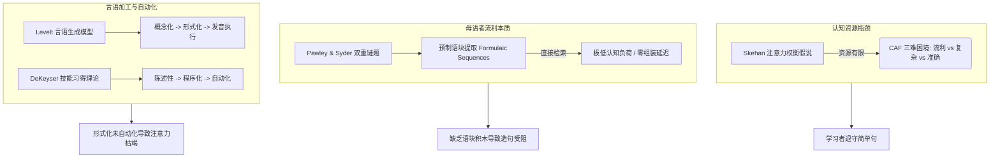

# 第二语言习得与口语认知理论基础

> **文档性质**：KaiwaDemo 认知语言学与第二语言习得（SLA）理论参考底稿  
> **归档路径**：`docs/sla-theoretical-foundations.md`  
> **服务目标**：为“降低开口阻力”、“语块化输入”、“上行牵引力机制”与“复盘重说”提供认知科学与实证研究支撑

---

## 一、 问题背景与核心认知矛盾

在二语口语训练中，初中级学习者（乃至具备一定应试词汇与语法的 N2 相当水平者）常表现出以下两项典型行为阻滞：
1. **回避高阶表达**：在实际交际中本能退守至最基础、最简单的句式，缺乏主动尝试复杂句的意愿。
2. **缺乏参照图景**：在心理表征层面，学习者常常“不知道更地道、更复杂的句子具体长什么样”，难以仅凭规则自主生成得体表达。

认知心理语言学与二语习得领域近四十年的实证研究表明，上述现象并非学习意志薄弱或态度消极，而是人类在面对面即时交际情境下受限于**大脑工作记忆（Working Memory）容量瓶颈**的生理性适应策略。

---

## 二、 核心理论模型与认知机制

### 1. Skehan 注意力权衡假说（Trade-off Hypothesis / CAF 模型）
* **核心代表学者**：Peter Skehan (1998, 2009)
* **理论内核**：
  二语口语产出由三个相互竞争的维度构成：
  * **复杂度（Complexity）**：语言结构的丰富度、从句嵌套程度与高阶词汇语块的调用。
  * **准确度（Accuracy）**：语法规则遵从度、形态屈折正确性与搭配规整度。
  * **流利度（Fluency）**：停顿频率、发话语速与修复重说频率。
* **竞争机制**：
  人类的注意力和工作记忆资源是严格受限的（Limited Attention Capacity）。在具有时间压力的实时会话中，学习者为了保障最基本的**交际流利度**（不冷场、即时回应），认知系统会自动切断对**结构复杂度**与**语法准确度**的监控资源分配。
* **教学推论**：
  若不在任务流程中提供外在支架或降低即时应答压迫，强行要求学习者“使用复杂句”必然直接引发言语停滞或表达崩溃。

---

### 2. 预制语块理论与母语者流利本质（Formulaic Sequences）
* **核心代表学者**：Andrew Pawley & Frances Syder (1983), Alison Wray (2002, 2008)
* **理论内核**：
  Pawley & Syder 在经典论文中提出了著名的“双重谜题”（Two Puzzles）：
  1. **母语者即时流利之谜**：母语者为何能在百毫秒级的交际空隙中连贯输出，毫无计算与拼装痕迹？
  2. **母语者自然选词之谜**：生成语法可以产生海量合法句子，为何母语者在特定情境中偏偏高度一致地选择极其狭窄的特定句式？
* **结论与机制**：
  * 母语者的流利并非基于“语法规则 + 离散单词”的现场实时编译，而是依赖长时记忆中储存的大量**预制语块（Prefabricated Chunks / Formulaic Sequences）**或**词汇化句子框架（Lexicalized Sentence Stems）**。
  * 母语者在发话时直接提取完整语块（如 `〜ていただけると助かります`、`恐れ入りますが`），无需逐词计算助词搭配或形态活用，从而将宝贵的工作记忆释放给更高阶的语篇逻辑和情境意图把控。
* **教学推论**：
  成年二语学习者“不知道复杂句子长什么样”，根源在于其大脑内缺乏与具体情境绑定的**整块功能语块**。外语教学长期以离散单词和抽象语法为核心，导致学习者必须依靠规则“硬造句子”，导致认知负荷过载并催生生硬的中式表达。

---

### 3. 言语生成模型与技能自动化进程
* **核心代表学者**：Willem Levelt (1989), Robert DeKeyser (2001, 2007, 2020)
* **言语加工三阶段（Levelt Model）**：
  $$\text{概念化 (Conceptualization)} \longrightarrow \text{形式化 (Formulation)} \longrightarrow \text{发音执行 (Articulation)}$$
  * 母语者的“形式化（检索词条、形态句法编码、音韵规整）”是高度自动化且并行处理的。
  * 二语学习者的“形式化”则是串行且受控的（Controlled Processing），每一处助词选择、敬语层级判断都需要意识全程介入监控。
* **技能习得三阶跃迁（DeKeyser Skill Acquisition Theory）**：
  1. **陈述性知识（Declarative Stage）**：掌握规则与意义（如知道谦让语与尊敬语的语法定义）。
  2. **程序化阶段（Proceduralization）**：在真实交际约束下逐步建立“如果处在某情境，则选用某句式”的行为联结，但响应滞后。
  3. **自动化阶段（Automatization）**：经过足量针对性练习，执行错误率趋近于零，反应时显著压低，彻底脱离意识层监控。
* **教学推论**：
  只有低阶语言单位（基础应答、起手式、连接语块）完成了程序化与自动化，学习者的大脑才有余裕将空闲认知资源投入到高阶句式和复杂诉求的组织上。

---

## 三、 驱动复杂表达与能力上行的实证干预路径

学术界在任务型语言教学（TBLT, Task-Based Language Teaching）领域的一系列受控对比实验，证明了以下机制能有效破除“退守简单句”的僵局：

### 1. Merrill Swain 的“受推输出假说”（Pushed Output Hypothesis）
* **核心机制**：单纯的可理解输入（Comprehensible Input）无法保证产出能力的建立。学习者必须在安全边界内被适度“推一把”（Pushed），尝试表达超出其现有自动化能力的交际意图。
* **认知功能（Noticing Function）**：受推输出迫使学习者从浅层的“语义理解加工”转向深层的“句法形态加工”，促使其敏锐注意到自身想表达的意图与当前实际输出水平之间的落差（Notice the Gap），激发语言系统的重构。

### 2. Peter Robinson 的任务前预规划（Pre-task Planning）
* **核心机制**：依据 Robinson 的认知假说（Cognition Hypothesis），若在执行高复杂度交际任务前，为学习者提供 1 至 3 分钟的非受迫预规划窗口，或提供情境锚点与支架框架（Scaffolding）：
  * 大脑可以在无即时社交压迫的情境下提前完成形式化检索；
  * 实验证明该机制可使随后口语发话中的**句式复杂度与语法准确度同时显著跃升**，且不以损害流利度为代价。

### 3. Bygate 任务重复与原型重构实验（Task Repetition & Reformulation）
* **实验设计（Martin Bygate, 1996）**：
  受试者在完成初次口语表达后，不切换场景，而是被提供高水平母语者的优化改写范例（Reformulation），随后在同一场景下立即进行第二轮发话重说。
* **实证发现**：
  在第二次发话时，学习者使用的复杂从句数量、地道固定搭配量以及语流连续性均出现显著飞跃。
  * **机制解释**：初次发话已经消耗了用于理解情境和规划思想内容的认知开销；重说时，学习者的大脑得以将全部工作记忆集中于**语言形式与地道语块的升级置换**。

---

## 四、 理论成果对 KaiwaDemo 系统设计的映射参照

| SLA 学术理论 / 实证发现 | 学习者认知机理 | KaiwaDemo 的系统机制与设计映射 |
|---|---|---|
| **Skehan 注意力权衡假说** | 面对面抢话会强制大脑退守简单词句保流利 | **半双工回合制 + 转写确认安全垫**：坚决摒弃抢话式全双工，听与说解耦，提供思考时间，卸载即时社交焦虑。 |
| **Pawley & Wray 预制语块理论** | 学习者不知道复杂句形式，现场硬拼语法会卡死 | **4 级阶梯提示（L2 语块 / L3 起手句）+ 场景前弹药预热**：直接下发整块功能结构，替代词汇零碎拼装。 |
| **Robinson 任务前规划机制** | 开口前获得框架支架可显著拉升发话复杂度 | **场景契约建立 + 盲练首句缓冲**：使学习者在明确任务锚点后自主规划发话结构。 |
| **Swain 受推输出假说** | 无外在拉力时学习者必然留在舒适区 | **上行牵引力机制（i+1 隐性输入 + 升级挑战入口）**：AI 相手使用高半级的语块，UI 侧提供非阻塞升级参考与微挑战。 |
| **Bygate 任务重复与重构实验** | 同一场景卸下内容负担后，第二遍专注语言形式跃升 | **集中复盘 + 达人升级（masterUpgrade）+ 原地立即重说（Immediate Retry）**：首遍达成交际目标，重说专注肌肉记忆强化与表达升级。 |

---

## 五、 关键文献清单（References）

1. **Bygate, M.** (1996). *Effects of task repetition: Appraising the development of second language learners*. In J. Willis & D. Willis (Eds.), *Challenge and Change in Language Teaching* (pp. 136–146). Heinemann.
2. **DeKeyser, R. M.** (2007). *Practice in a Second Language: Perspectives from Applied Linguistics and Cognitive Psychology*. Cambridge University Press.
3. **Levelt, W. J. M.** (1989). *Speaking: From Intention to Articulation*. MIT Press.
4. **Pawley, A., & Syder, F. H.** (1983). *Two puzzles for linguistic theory: Nativelike selection and nativelike fluency*. In J. C. Richards & R. W. Schmidt (Eds.), *Language and Communication* (pp. 191–226). Longman.
5. **Robinson, P.** (2001). *Task complexity, task difficulty, and task production: Exploring interactions in a componential framework*. *Applied Linguistics*, 22(1), 27–57.
6. **Skehan, P.** (1998). *A Cognitive Approach to Language Learning*. Oxford University Press.
7. **Skehan, P.** (2009). *Modelling second language performance: Integrating complexity, accuracy, fluency, and lexis*. *Applied Linguistics*, 30(4), 510–532.
8. **Swain, M.** (1995). *Three functions of output in second language learning*. In G. Cook & B. Seidlhofer (Eds.), *Principle and Practice in Applied Linguistics* (pp. 125–144). Oxford University Press.
9. **Wray, A.** (2002). *Formulaic Language and the Lexicon*. Cambridge University Press.
